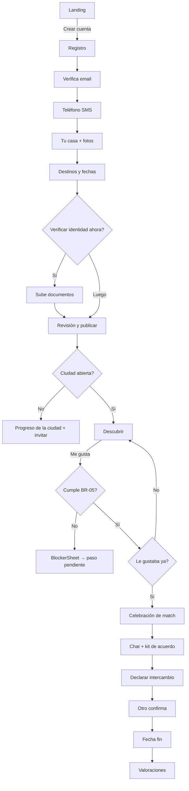

# 02 · UX/UI SPEC — TinHome Fase 1

| Campo | Valor |
|---|---|
| Versión | 2.0 · 08/10/2026 |
| Depende de | `01_PRD.md` (funcionalidades y reglas) |
| Identidad visual | **Definida (DEC-62):** logo, favicon y colores corporativos en `11_BRAND_GUIDELINES.md` y `assets/brand/`. Implementar **solo con tokens** |

> **Para agentes de IA:** la experiencia es el producto. Antes de dar una pantalla por terminada, comprueba la lista de §11 (estados de carga, vacío y error; accesibilidad; textos en `es.json`; móvil a 360 px).

---

## 1. Principios de experiencia

| # | Principio | Cómo se aplica |
|---|---|---|
| UX-1 | **Descubrir es un juego, decidir es serio** | Descubrir es ágil y táctil (deslizar, animaciones, celebración del match). Verificar, publicar y declarar intercambios son pantallas tranquilas, explicativas y sin prisa. |
| UX-2 | **Confianza visible en cada tarjeta** | Badges Verificado/Top/Fundador, valoraciones y «miembro desde» siempre a la vista. Nunca se muestra la dirección. |
| UX-3 | **Cada bloqueo explica el camino** | Si algo no se puede hacer, se dice por qué y se ofrece el botón que lo resuelve («Te falta verificar tu identidad → Verificar ahora»). |
| UX-4 | **Pagar es una ayuda, no un muro** | Paywalls contextuales y en hojas inferiores, nunca en el onboarding, siempre con «Ahora no». |
| UX-5 | **Una acción principal por pantalla** | Un botón primario; el resto, secundario o en menú. |
| UX-6 | **Progreso siempre visible** | Onboarding con pasos; «Perfil X %»; progreso de apertura de la ciudad. |
| UX-7 | **Rápido de verdad** | Esqueletos, imágenes precargadas, actualizaciones optimistas (me gusta) con reversión si falla. |
| UX-8 | **Accesible por defecto** | Cada gesto tiene botón y atajo; contraste AA; movimiento reducido respetado. |

---

## 2. Arquitectura de información y navegación

### 2.1 Navegación de la app (usuario)

- **Móvil (< 768 px):** barra inferior fija con 5 pestañas, iconos + etiqueta:
  1. **Descubrir** (`Sparkles`) · 2. **Explorar** (`Search`) · 3. **Me gusta** (`Heart`, badge con número de recibidos nuevos) · 4. **Chats** (`MessageCircleHeart`, badge con mensajes no leídos + matches nuevos) · 5. **Perfil** (`User`, punto si el perfil está incompleto).
- **Escritorio (≥ 1024 px):** barra lateral izquierda con las mismas secciones + «Mi casa», «Premium», «Invita y gana»; contenido centrado (máx. 1200 px); Descubrir con la tarjeta centrada (máx. 440 px) y panel derecho con la ficha ampliada.
- **Cabecera móvil:** logo a la izquierda; a la derecha campana de avisos (badge) y chip Premium («Prueba Premium» o «Premium ✓»).

### 2.2 Rutas

| Ruta | Pantalla | Acceso |
|---|---|---|
| `/` | Landing | Pública |
| `/como-funciona` | Cómo funciona | Pública |
| `/precios` | Planes | Pública |
| `/lista-espera` | Apuntarse a la lista de espera | Pública |
| `/legal/:slug` | Textos legales | Pública |
| `/denunciar` | Denuncia pública (DSA) | Pública |
| `/ayuda` · `/ayuda/:slug` | Centro de ayuda y preguntas frecuentes | Pública (también dentro de la app) |
| `/reclamaciones` | Quejas y reclamaciones (visitante con email) | Pública |
| `/i/:code` | Enlace de invitación → registro con `ref` | Pública |
| `/registro`, `/entrar`, `/recuperar`, `/verifica-email` | Acceso | Pública |
| `/app/onboarding/:paso` | Asistente (1–6) | Usuario |
| `/app/descubrir` | Mazo | Usuario |
| `/app/explorar` | Cuadrícula y filtros | Usuario |
| `/app/casa/:homeId` | Ficha de casa | Usuario |
| `/app/me-gusta` | Me gusta recibidos | Usuario |
| `/app/chats` · `/app/chats/:matchId` | Lista de chats (matches) y conversación | Usuario |
| `/app/soporte` · `/app/soporte/:ticketId` | Mis quejas y reclamaciones | Usuario |
| `/app/verificacion/ubicacion` | Verificación de ubicación (móvil) | Usuario |
| `/app/intercambios/:exchangeId` | Ficha del intercambio | Participante |
| `/app/valorar/:exchangeId` | Valorar | Participante |
| `/app/perfil` | Perfil, Mi casa, estado Premium | Usuario |
| `/app/mi-casa` · `/app/mi-casa/editar` | Mi casa | Usuario |
| `/app/viaje` | Destinos, ventanas, fechas, viajeros | Usuario |
| `/app/verificacion` | Teléfono e identidad | Usuario |
| `/app/premium` | Planes y gestión | Usuario |
| `/app/invita` | Referidos | Usuario |
| `/app/avisos` | Centro de avisos | Usuario |
| `/app/ajustes` (+ `/privacidad`, `/bloqueados`, `/notificaciones`, `/cuenta`) | Ajustes | Usuario |
| `/admin/*` | Panel (ver §9) | admin/superadmin + 2FA |

### 2.3 Guardas de ruta (orden)
1. Sin sesión → `/entrar?next=…`. 2. Email sin verificar → `/verifica-email`. 3. Onboarding incompleto (pasos 2–4) → `/app/onboarding/:siguiente` (los pasos 5–6 se pueden completar después; Descubrir muestra el bloqueo explicativo). 4. Textos legales pendientes de reaceptación → modal bloqueante. 5. `/admin` sin rol o sin 2FA → 404 (no revelar existencia).

---

## 3. Sistema de diseño (tokens)

Implementación: **Tailwind CSS v4** con variables CSS en `:root` (tema claro), `[data-theme="dark"]` (oscuro) y `[data-theme="black"]` (negro); componentes basados en **shadcn/ui (Radix)**. **Nunca** se usan colores hex en componentes: solo tokens. La marca completa (logo, usos, favicon) está en **`11_BRAND_GUIDELINES.md`**.

### 3.1 Colores corporativos (extraídos del logo)

| Nombre | Hex | Rol |
|---|---|---|
| **Violeta TinHome** | `#8257E5` | Casa izquierda y «Tin». Color de marca secundario: chips, badges, degradado, ilustraciones |
| **Azul TinHome** | `#0A6CF0` | Casa derecha y «Home». **Color primario**: botones, enlaces, foco |
| **Azul Cielo** | `#2191FC` | Brillos del logo. Acento: gráficos, ilustraciones, estados destacados (nunca texto sobre claro) |
| **Violeta Profundo** | `#6440CB` | Sombra del logo. Hover/pressed del violeta, texto violeta sobre claro |
| **Degradado TinHome** | `linear-gradient(135deg, #8257E5 0%, #0A6CF0 100%)` | Botón «Me gusta», CTA principal de la landing, celebración del match, icono de la app |

Escalas (para estados y fondos suaves): 

| Paso | Violeta | Azul | Cielo |
|---|---|---|---|
| 50 | `#F5F2FD` | `#EBF3FE` | `#EDF6FF` |
| 100 | `#EBE4FB` | `#D8E7FD` | `#DBEDFF` |
| 200 | `#D7C9F7` | `#B1D0FA` | `#B8DCFE` |
| 300 | `#BEA8F1` | `#80B3F7` | `#8CC6FD` |
| 400 | `#A07FEB` | `#458FF4` | `#56ABFD` |
| 500 | `#8257E5` | `#0A6CF0` | `#2191FC` |
| 600 | `#714CC9` | `#0A5ED3` | `#1E7EDD` |
| 700 | `#5E3FAA` | `#0A4EB2` | `#1A68BA` |
| 800 | `#493186` | `#0A3C8C` | `#164F92` |
| 900 | `#362467` | `#0B2C6B` | `#13396F` |
| 950 | `#25194B` | `#0B1E4E` | `#102650` |

### 3.2 Tokens por tema

Tres temas: **Claro**, **Oscuro** (azul noche con matiz violeta) y **Negro** (OLED, `#000`). Selector en Ajustes › Tema: *Sistema* (claro u oscuro según el dispositivo) · Claro · Oscuro · Negro.

| Token | Claro | Oscuro | Negro | Uso |
|---|---|---|---|---|
| `--bg` | `#F7F6FB` | `#0F0D1A` | `#000000` | Fondo de página |
| `--surface` | `#FFFFFF` | `#1A1730` | `#0E0D14` | Tarjetas, hojas, barra inferior |
| `--surface-muted` | `#F0EEF7` | `#24203D` | `#17151F` | Fondos secundarios, esqueletos, inputs |
| `--border` | `#E4E1EE` | `#2E2A47` | `#262335` | Bordes y separadores |
| `--text` | `#1B1830` | `#F4F2FA` | `#F4F2FA` | Texto principal (≥ 16:1) |
| `--text-muted` | `#5B5670` | `#A9A3BF` | `#A9A3BF` | Texto secundario (≥ 6,4:1) |
| `--primary` | `#0A6CF0` | `#458FF4` | `#458FF4` | Botón primario, enlaces destacados |
| `--primary-hover` | `#0A5ED3` | `#80B3F7` | `#80B3F7` | Hover/pressed |
| `--primary-foreground` | `#FFFFFF` | `#0B0820` | `#0B0820` | Texto sobre primario (≥ 4,7:1) |
| `--link` | `#0A5ED3` | `#80B3F7` | `#80B3F7` | Enlaces en texto |
| `--brand` | `#8257E5` | `#A07FEB` | `#A07FEB` | Violeta de marca (fondos de chips, badges, iconos) |
| `--brand-text` | `#6440CB` | `#BEA8F1` | `#BEA8F1` | Texto violeta sobre fondo |
| `--brand-soft` | `#F5F2FD` | `#25194B` | `#1A1233` | Fondo suave de chips de marca |
| `--accent` | `#2191FC` | `#56ABFD` | `#56ABFD` | Acento decorativo, gráficos, «Encaje perfecto» (con icono) |
| `--gradient-from` / `--gradient-to` | `#8257E5` / `#0A6CF0` | `#8257E5` / `#0A6CF0` | `#8257E5` / `#0A6CF0` | Degradado de marca, **igual en los tres temas** (texto blanco encima ≥ 4,7:1; no aclararlo en oscuro) |
| `--like` | degradado de marca | degradado | degradado | Botón y sello «Me gusta» |
| `--pass` | `#5B5670` | `#A9A3BF` | `#A9A3BF` | Botón y sello «Paso» |
| `--premium` | `#A16207` | `#FACC15` | `#FACC15` | Premium (dorado; distinto de la marca a propósito) |
| `--success` | `#15803D` | `#4ADE80` | `#4ADE80` | Éxito |
| `--warning` | `#B45309` | `#FBBF24` | `#FBBF24` | Aviso |
| `--danger` | `#B91C1C` | `#F87171` | `#F87171` | Error, denunciar |
| `--focus` | `#0A6CF0` | `#80B3F7` | `#80B3F7` | Anillo de foco (2 px + 2 px offset) |
| `--overlay` | `rgb(11 8 32 / 0.55)` | `rgb(0 0 0 / 0.65)` | `rgb(0 0 0 / 0.75)` | Fondo de modales y hojas |
| `--card-scrim` | `linear-gradient(transparent, rgb(11 8 32 / 0.85))` | igual | igual | Degradado inferior de las fotos del mazo (texto blanco legible sobre cualquier foto) |

**Contrastes comprobados (WCAG 2.2):** blanco sobre Azul TinHome 4,76:1 y sobre Violeta TinHome 4,73:1 (texto normal AA); `--text-muted` claro 6,49:1; degradado con texto blanco ≥ 4,73:1 en los tres temas; en oscuro, `--primary` sobre `--bg` 5,94:1, `--brand-text` sobre `--surface` 8,32:1 y `--primary-foreground` sobre `--primary` 6,06:1; `--text-muted` en negro 8,68:1. **El Azul Cielo no se usa para texto sobre fondos claros** (3,0:1).

**Reglas de tema oscuro y negro:**
- Nunca colores de marca saturados a 500 sobre fondo oscuro para textos pequeños: usar los pasos 300–400 de la tabla.
- Sin sombras (no se ven): la elevación se marca con `--surface` más claro y `--border`.
- En **negro**, las superficies se separan con borde de 1 px; evitar grandes áreas de color saturado (fatiga y *smearing* en OLED).
- Las fotos mantienen su brillo; el `--card-scrim` garantiza el texto.
- `<meta name="theme-color">` dinámico: `#F7F6FB` (claro), `#0F0D1A` (oscuro), `#000000` (negro); `color-scheme` acorde.
- El logo cambia de variante según el tema (§3.4 y `11_BRAND_GUIDELINES.md`).

### 3.3 Tipografía
- Titulares: **Nunito** (700/800), redondeada como el logotipo. Texto: **Inter** (400/500/600). **Autoalojadas** con `@fontsource` (no Google Fonts CDN: evita transferir IPs a terceros).
- Escala (rem): `display 2.25/1.1` · `h1 1.75/1.2` · `h2 1.375/1.25` · `h3 1.125/1.3` · `body 1/1.5` · `small 0.875/1.45` · `caption 0.75/1.4`. Mínimo 16 px en inputs (evita zoom en iOS).

### 3.4 Logo, iconos, espaciado, radios y movimiento
- **Logo:** `TinHomeLogo` (C-25) elige la variante según el tema: `light` en tema claro, `dark` en oscuro y negro, `mono-white` sobre el degradado o fotos. Cabecera móvil: isotipo 32 px; escritorio y landing: horizontal (alto 32–40 px). Nunca recrear el logo con texto ni cambiar sus colores.
- Espaciado base 4 px: `1=4, 2=8, 3=12, 4=16, 5=20, 6=24, 8=32, 10=40, 12=48`. Margen lateral móvil 16 px.
- Radios: `sm 8`, `md 12`, `lg 16`, `xl 24` (tarjetas del mazo), `full` (chips, avatares).
- Sombras (solo tema claro): `card` `0 1px 2px rgb(27 24 48 / .06), 0 8px 24px rgb(27 24 48 / .08)`; `sheet` más pronunciada. En oscuro y negro, bordes.
- Movimiento: duraciones `fast 120 ms`, `base 200 ms`, `slow 320 ms`; easing `cubic-bezier(0.2, 0.8, 0.2, 1)`. Con `prefers-reduced-motion`: sin rotación ni rebotes; transiciones de opacidad.
- Iconos: `lucide-react`, 20 px (24 px en barra inferior), trazo 2.
- Zonas táctiles ≥ 44 × 44 px.

---

## 4. Catálogo de componentes

| ID | Componente | Descripción y comportamiento |
|---|---|---|
| C-01 | `AppShell` | Cabecera + barra inferior (móvil) / lateral (escritorio); gestiona áreas seguras (`env(safe-area-inset-*)`). |
| C-02 | `SwipeDeck` | Pila de 3 tarjetas visibles (la siguiente escalada 0,96). Arrastre con `motion` (`drag="x"`): rotación ±12°, umbral 30 % del ancho o velocidad > 500 px/s; sellos «ME GUSTA» (degradado de marca) / «PASO» (`--pass`) que aparecen según el desplazamiento; vuelve al centro si no supera el umbral. Teclado: ←/→/↑/Z. Precarga las imágenes de las 3 siguientes. Anuncio `aria-live`. |
| C-03 | `HomeCard` | Foto a sangre (relación 3:4) con barras de galería arriba; degradado inferior con título, ciudad · zona, capacidad, badges y chips de compatibilidad. Toque izquierda/derecha cambia foto; toque centro abre ficha. |
| C-04 | `ActionBar` | Botones circulares: Deshacer (pequeño), Paso (grande, `--pass`, icono X), Ficha (pequeño), **Me gusta** (grande, **degradado TinHome** con corazón blanco). Etiquetas accesibles; el significado nunca depende solo del color. |
| C-05 | `MatchCelebration` | Pantalla completa: dos fotos que se acercan y se solapan, confeti sutil (desactivado con movimiento reducido), «¡Es un match con Javier!», chips de compatibilidad, CTA primaria «Ver contacto», secundaria «Seguir descubriendo», enlace «Descargar acuerdo de intercambio», tarjeta patrocinada opcional. |
| C-06 | `CompatibilityChips` | Chips: «Encaje perfecto» (accent sólido), «Quiere venir a Madrid», «Semana Santa en común», «Te ha dado me gusta» (solo Premium), «Admite mascotas». Máx. 3 en tarjeta. |
| C-07 | `TrustBadges` | Verificado (check), Top (estrella dorada), Fundador (sello), nº valoraciones. Tooltip explicativo. |
| C-08 | `PaywallSheet` | Hoja inferior con titular contextual, 3 ventajas, precio con IVA, «Probar Premium» y «Ahora no». |
| C-09 | `BlockerSheet` | Hoja que explica por qué no se puede hacer algo y lleva al paso que lo resuelve (lista de requisitos con check). |
| C-10 | `ProgressStepper` | Pasos del onboarding con número, título y estado; en móvil barra superior con «Paso 3 de 6». |
| C-11 | `PhotoUploader` | Zona de arrastre + botón «Hacer foto»; miniaturas reordenables (`dnd-kit`), la primera marcada «Portada»; progreso por foto; guía de fotos (luz natural, horizontal, cada estancia). |
| C-12 | `DateRangePicker` | Calendario de rango (lunes primero, `es-ES`), atajos a ventanas activas. |
| C-13 | `CityProgress` | Barra de progreso hacia la apertura con número, umbral y CTA «Invita a alguien». |
| C-14 | `DemandCounter` | «47 personas de Valencia quieren ir a Madrid en Semana Santa». |
| C-15 | `SponsoredCard` | Tarjeta con etiqueta «Patrocinado» visible, logo, texto y botón; nunca imita una casa. |
| C-16 | `EmptyState` | Ilustración simple (SVG con tokens), título, texto y 1–2 acciones. |
| C-17 | `Skeleton` | Esqueletos de tarjeta, lista y ficha. |
| C-18 | `ReportDialog` | Motivos de FR-42 con icono y explicación corta (primero «Fotos que no son de su vivienda» y «Trato grosero o irrespetuoso»), descripción, adjuntos (capturas), mensaje denunciado precargado si viene del chat, aviso de buena fe, enviar. Confirmación: «Revisaremos tu denuncia a fondo y te informaremos del resultado.» Ofrece además «Bloquear a esta persona». |
| C-19 | `ConfirmDialog` | Para acciones destructivas (deshacer match, bloquear, baja): título claro, consecuencia y botón con el verbo. |
| C-20 | `StatusBanner` | Banners de estado de cuenta/casa (verificación pendiente, casa pausada, suspensión). |
| C-21 | `RatingInput` / `RatingSummary` | Estrellas accesibles (radio group) y resumen con subpuntuaciones. |
| C-22 | `SecureDocViewer` (admin) | Visor con marca de agua «Solo verificación TinHome», sin descarga ni clic derecho, zoom, rotar. |
| C-23 | `DataTable` (admin) | Tabla con orden, filtros, paginación, selección y acciones por fila. |
| C-24 | `Toast` | Confirmaciones y errores (sonner); con «Deshacer» cuando aplique. |
| C-25 | `TinHomeLogo` | Props `variant: 'horizontal'\|'symbol'\|'full'`, `tone?: 'auto'\|'light'\|'dark'\|'mono-white'`. En `auto` elige según el tema activo. `alt="TinHome"`; si va junto a texto que ya dice TinHome, `alt=""`. |
| C-26 | `ThemeSwitcher` | Opciones Sistema / Claro / Oscuro / Negro con vista previa en miniatura; aplica `data-theme` en `<html>` sin parpadeo (script inline en `index.html` lee la preferencia antes de pintar) y la guarda con `updateSettings`. |
| C-27 | `ChatThread` | Lista virtualizada de mensajes (carga los 50 últimos y pagina hacia arriba), burbujas propias (`--primary`) y ajenas (`--surface-muted`), hora, separadores de día, estado ✓ enviado / ✓✓ leído, mensajes de sistema centrados, aviso de seguridad fijo la primera vez, menú por mensaje (Copiar, Denunciar, Eliminar para mí). Desplazamiento automático solo si el usuario está al final; botón «↓ Nuevos mensajes». |
| C-28 | `MessageComposer` | Campo autoexpansible (máx. 5 líneas), contador al acercarse a P-28, enviar con Enter (Shift+Enter salto) en escritorio y botón en móvil, envío optimista con reintento si falla; sugerencias rompehielo en chats vacíos. Respeta el teclado móvil (`visualViewport`). |
| C-29 | `LocationCheck` | Explica para qué se usa la ubicación y qué se guarda, botón «Verificar ubicación», estados: pidiendo permiso · leyendo (spinner) · verificada ✓ · no coincide (reintentar / revisión manual) · precisión insuficiente (consejos) · permiso denegado (cómo activarlo por navegador) · escritorio (QR para abrir en el móvil). |
| C-30 | `HelpCenter` | Buscador con resultados instantáneos, categorías en tarjetas, artículo con «¿Te ha servido?» y botón «Contactar con TinHome». |
| C-31 | `ComplaintForm` / `TicketThread` | Formulario de FR-67 y vista de la solicitud con estado, plazo y respuestas. |
| C-32 | `PushPrompt` | Hoja propia (antes del permiso del navegador) tras el primer match: «Entérate al momento cuando te escriban» · Activar / Ahora no. En iPhone sin instalar: guía «Añadir a pantalla de inicio». |
| C-33 | `StrikeNotice` | Banner y pantalla con la advertencia o restricción, motivo, duración, advertencias activas (1/3) y botón «Recurrir». |

---

## 5. Pantallas

Cada pantalla define: **objetivo · contenido · acciones · estados (carga / vacío / error) · textos clave**.

### S-01 Landing (`/`)
- **Objetivo:** que el visitante entienda en 5 s y se apunte o se registre.
- **Estilo:** fondo `--bg` con un halo suave del degradado de marca detrás del mock; logo horizontal en la cabecera; CTA principal con el degradado TinHome.
- **Contenido:** héroe «Intercambia tu casa. Viaja por España sin pagar alojamiento.» + subtítulo «Haz match con casas de personas verificadas que quieren venir a tu ciudad.» + CTA «Crear cuenta gratis» y secundaria «Cómo funciona». Mock de tarjeta deslizando (animación de 3 s, en bucle, pausable). Tres pasos (Publica gratis · Haz match · Acordad e intercambiad). Bloque de confianza (verificación manual, valoraciones, sin dinero entre usuarios). `DemandCounter` en vivo y `CityProgress` de las ciudades del corredor. Preguntas frecuentes (¿Cuánto cuesta? ¿Es seguro? ¿Y si soy inquilino? ¿TinHome participa en el acuerdo?). Pie con enlaces legales y «Denunciar contenido».
- **Nota:** no usar la palabra «Tinder» en ningún texto (marca de terceros).

### S-02 Registro / Entrar / Recuperar / Verifica tu email
- Registro en una sola columna, botón «Continuar con Google» arriba, separador «o con tu email». Validación en línea al salir del campo. Contraseña con indicador y «mostrar». Casillas de Términos y Privacidad con enlaces que abren en hoja (sin perder el formulario).
- Verifica tu email: ilustración, email enmascarado, «Reenviar» con cuenta atrás de 60 s, «Cambiar email».

### S-03 Onboarding (`/app/onboarding/:paso`)
Barra superior «Paso N de 6» + título; botón «Guardar y salir». Cada paso explica **por qué** se pide:

| Paso | Contenido | Microcopy de confianza |
|---|---|---|
| 1 | Bienvenida con tu nombre y qué vas a hacer (3 min) | «Publicar es gratis. Solo pagas si quieres Premium.» |
| 2 | Teléfono +34 → código SMS (6 casillas, autocompletar) | «Solo lo verá la persona con la que hagas match, para que podáis hablar.» |
| 3 | Tu casa en 3 subpantallas: datos básicos → fotos (guía) → descripción y normas, con vista previa de la tarjeta en vivo | «Nunca mostramos tu dirección. Solo ciudad y zona.» |
| 4 | Adónde quieres ir (chips de ciudades + «Cualquier ciudad abierta») y cuándo (ventanas como tarjetas seleccionables + «Añadir fechas propias»); viajeros y mascota | «Te enseñaremos primero casas cuyos dueños quieren venir a tu ciudad en tus mismas fechas.» |
| 5 | Verificación (puede hacerse luego): **a)** identidad: DNI anverso/reverso, selfie con el DNI, documento de la casa, autorización del arrendador si alquilas; **b)** **ubicación de la casa** con `LocationCheck` (desde el móvil, estando en casa) | «Lo revisa una persona del equipo, no un algoritmo. Borramos los documentos 30 días después.» · «Solo comprobamos que tu casa está en la ciudad que indicas; no guardamos tu ubicación exacta.» |
| 6 | Revisión: vista previa de la tarjeta, checklist de requisitos, declaración responsable, «Publicar mi casa» | «Podrás pausarla cuando quieras.» |

Final: pantalla de éxito; si la ciudad está en lista de espera → `CityProgress` + «Invita a alguien de [destino favorito]».

### S-04 Descubrir (`/app/descubrir`)
- **Contenido:** `SwipeDeck` + `ActionBar`; contador de me gusta restantes (gratis) bajo la barra; chip de filtro rápido de destino arriba («A: Valencia ▾»).
- **Estados:**
  - Carga: esqueleto de tarjeta.
  - **No cumple BR-05:** la tarjeta se ve, pero el primer me gusta abre `BlockerSheet` con checklist (Identidad verificada ✗ · Casa publicada ✓ · Fechas ✓) y botón al paso pendiente.
  - **Ciudad propia en lista de espera:** banner superior «Tu ciudad abre pronto. Puedes mirar, pero aún no dar me gusta» + `CityProgress`.
  - **Mazo vacío:** `EmptyState` «Has visto todas las casas que encajan» + acciones: «Ampliar destinos», «Añadir fechas», «Invitar a alguien».
  - **Límite alcanzado (gratis):** `PaywallSheet` «Has usado tus 10 me gusta de hoy» + «Se renuevan a las 00:00».
  - Error de red: toast + reintento; el gesto se revierte.
- Cada 12 tarjetas (solo gratis, si hay partner activo) aparece una `SponsoredCard` que se pasa con el mismo gesto.

### S-05 Explorar (`/app/explorar`)
- Barra de filtros fija con chips (Destino, Fechas, Viajeros, Mascotas, Más filtros) y hoja de filtros completa; filtros Premium con candado que abre `PaywallSheet`. Cuadrícula de 1 col (móvil) / 2–3 col; paginación infinita. Colección «Casas Top» como carrusel arriba (Premium; gratis la ve difuminada con CTA).
- Vacío: «No hay casas con estos filtros» + «Quitar filtros».

### S-06 Ficha de casa (`/app/casa/:homeId`)
- Galería (deslizable, pantalla completa al tocar), título, ciudad · zona, fila de iconos (personas, dormitorios, camas, baños, m²), badges, chips de compatibilidad, disponibilidad (ventanas y rangos), «Quiere viajar a…», servicios (iconos), normas, bloque del anfitrión (foto, nombre visible, sobre mí, idiomas, miembro desde, verificado), valoraciones (resumen + lista), menú «…» (Compartir, Denunciar, Bloquear). Barra inferior fija con Paso / Me gusta (o «Ya te gusta ✓» / «Es un match → Ver contacto»).

### S-07 Me gusta recibidos (`/app/me-gusta`)
- Gratis: titular «12 personas quieren intercambiar contigo» + cuadrícula de tarjetas difuminadas con `PaywallSheet` al tocar.
- Premium: cuadrícula con la casa y el titular, ordenadas por Encaje perfecto; acciones rápidas Me gusta (crea match al instante) / Paso.
- Vacío: «Aún nadie… Mejora tu casa: añade fotos con luz natural» + enlace a editar.

### S-08 Chats (`/app/chats`, `/app/chats/:matchId`)
- **Lista:** fila con foto de la casa, nombre visible, ciudad, vista previa del último mensaje (o «¡Nuevo match! Di hola 👋»), hora, contador de no leídos, chip Encaje perfecto y estado del intercambio si existe. Arriba, carrusel «Nuevos matches» sin conversación todavía. Vacío: «Aún no tienes matches. Sigue descubriendo» + botón a Descubrir.
- **Conversación** (pantalla completa en móvil; en escritorio, lista a la izquierda y chat a la derecha):
  - Cabecera: foto y nombre (abre la ficha de su casa), chip de compatibilidad, menú «…»: Ver su casa · Compartir mi teléfono · Declarar intercambio · Descargar acuerdo · Deshacer match · Bloquear · Denunciar.
  - Barra de **siguiente paso** plegable: «1. Hablad · 2. Descargad el acuerdo · 3. Declarad el intercambio para poder valoraros» con botón «Declarar intercambio».
  - `ChatThread` + `MessageComposer`. Si el otro compartió su teléfono, tarjeta fija con «Llamar» y «WhatsApp».
  - Aviso de seguridad la primera vez y cuando un mensaje menciona pagos: «Nunca envíes dinero ni datos bancarios. TinHome no participa en el acuerdo.»
  - Estados: cargando (esqueleto de burbujas) · sin conexión (banner «Sin conexión: enviaremos tus mensajes al volver») · match cerrado («Esta conversación ya no está disponible»).
- **Compartir teléfono:** confirmación «Javier verá tu número +34 6•• ••• •12 y podrá llamarte o escribirte por WhatsApp. No podrás retirarlo.» → mensaje de sistema en el chat.

### S-09 Declarar intercambio (hoja desde el match) y ficha (`/app/intercambios/:id`)
- Formulario: fechas (`DateRangePicker` con atajos a ventanas comunes), personas de cada lado (con límite de capacidad), mascotas (si se admiten), nota opcional. Resumen y «Enviar a Javier para confirmar».
- Ficha: estado con línea de tiempo (Propuesto → Confirmado → En curso → Completado), cuenta atrás, kit de acuerdo, checklist, `SponsoredCard` (limpieza/llaves) si existe, «Cancelar intercambio» (confirmación).

### S-10 Valorar (`/app/valorar/:id`)
- Paso a paso: estrellas globales → subpuntuaciones → comentario (con ejemplos) → enviar. Explicación del doble ciego: «Tu valoración se publicará cuando Javier también valore o en 14 días.»

### S-11 Perfil (`/app/perfil`)
- Tarjeta de estado: foto, nombre, badges, «Perfil 80 %» con lo que falta. Secciones: Mi casa (vista previa + Editar/Pausar), Mi viaje (destinos, fechas), Verificación (identidad y ubicación), Premium (estado y origen), Invita y gana, Ajustes, **Ayuda**, **Quejas y reclamaciones**, Cerrar sesión.

### S-12 Premium (`/app/premium`)
- Comparativa Gratis vs Premium (tabla de `01_PRD.md` FR-34), selector Mensual/Anual con ahorro destacado, precio con IVA, aviso de inicio inmediato + desistimiento (casilla), botón «Continuar al pago» (Stripe Checkout). Usuario Premium: estado, origen, fecha, «Gestionar suscripción» (portal) y, si aplica, «Desistir» (primeros 14 días).

### S-13 Invita y gana (`/app/invita`)
- Titular «Invita y ganáis 1 mes de Premium cada uno». Tarjeta destacada «¿Conoces a alguien en Valencia?» con compartir. Código, enlace, botones (WhatsApp, copiar, compartir nativo). Lista de invitados con estado (Registrado · Verificado ✓ recompensa).

### S-14 Verificación (`/app/verificacion`)
- Estado actual con explicación: Pendiente («Normalmente en 48 h»), Info solicitada (mensaje del admin + reenviar), Rechazada (motivo + volver a enviar), Aprobada.

### S-15 Ajustes
- Cuenta (email, contraseña, teléfono), Notificaciones (por categoría), Privacidad (descargar mis datos, solicitudes RGPD, textos aceptados), Bloqueados, Tema (`ThemeSwitcher`: Sistema/Claro/Oscuro/Negro), Baja de cuenta (flujo con consecuencias + reautenticación).

### S-17 Me gusta con mensaje (Premium)
- En Descubrir y en la ficha, junto al botón Me gusta, botón secundario «✉ Me gusta con mensaje» (con candado si no es Premium → `PaywallSheet` «Destaca entre todos: escribe antes del match»). Abre una hoja con campo de P-40 caracteres, sugerencias («Me encantaría ir a Valencia en Semana Santa, ¿y tú a Madrid?») y contador «Te quedan 4 hoy».
- Receptor: tarjeta destacada con borde de degradado y el mensaje entrecomillado en Me gusta recibidos y en el mazo.

### S-18 Verificación de ubicación (`/app/verificacion/ubicacion`)
- `LocationCheck` a pantalla completa. Texto: «Para evitar anuncios falsos, comprobamos una sola vez que tu casa está en {ciudad}. Hazlo desde el móvil, estando en tu casa.» Lista de lo que se guarda y lo que no. Resultado con animación sutil y siguiente paso.

### S-19 Ayuda (`/ayuda`) y quejas (`/reclamaciones`, `/app/soporte`)
- Ayuda: `HelpCenter`; accesos rápidos «Cómo funciona la verificación», «Mi casa no aparece», «Cómo denunciar», «Premium y pagos»; al final «¿No encuentras lo que buscas? → Quejas y reclamaciones» y «Denunciar a un usuario».
- Quejas: `ComplaintForm`; tras enviar, pantalla con número de seguimiento, plazo y enlace a «Mis solicitudes». Lista de solicitudes con estado; detalle con hilo y respuesta del usuario cuando se le pide información.

### S-20 Advertencias y restricciones
- `StrikeNotice` como banner en Perfil/Descubrir y en Ajustes › Mi cuenta. Retención preventiva: «Tu casa está en revisión por {motivo}. Normalmente lo resolvemos en 72 h. No tienes que hacer nada; si quieres aportar información, responde aquí.»

### S-16 Lista de espera pública (`/lista-espera`) y denuncia pública (`/denunciar`)
- Lista de espera: email, mi ciudad, adónde quiero ir, ventanas; doble opt-in; pantalla final con `CityProgress` y compartir.
- Denuncia pública: formulario FR-43 con explicación de qué pasa después y plazos.

---

## 6. Flujos principales

---

## 7. Microcopy y tono

- **Tú**, cercano, claro, sin tecnicismos ni jerga legal en la interfaz (el detalle legal va en enlaces). Frases cortas. Verbos en los botones («Publicar mi casa», no «Aceptar»).
- Nunca culpar al usuario en errores: «No hemos podido subir la foto. Prueba de nuevo o elige otra.»
- Prohibido en la interfaz: «alquilar», «precio por noche», «gratis» referido al alojamiento (usar «sin pagar alojamiento»), «Tinder», promesas de seguro o garantías.
- Todos los textos en `apps/web/src/i18n/es.json`, con claves por pantalla (`discover.empty.title`).

Textos clave de ejemplo:

| Clave | Texto |
|---|---|
| `match.title` | «¡Es un match con {name}!» |
| `match.subtitle` | «A los dos os gusta la casa del otro. Ahora podéis hablar y acordar las fechas.» |
| `blocker.identity` | «Para dar me gusta necesitamos verificar tu identidad. Así todos sabemos con quién hablamos.» |
| `limit.reached` | «Has usado tus {n} me gusta de hoy. Vuelven a las 00:00, o sigue sin límite con Premium.» |
| `waitlist.banner` | «{city} abre al llegar a {threshold} casas verificadas. Vamos por {count}.» |
| `safety.noMoney` | «TinHome no participa en el acuerdo. Nunca pagues ni envíes dinero a otro usuario.» |

---

## 8. Catálogo de notificaciones

| ID | Evento | Email | En la app | Destinatario |
|---|---|---|---|---|
| N-01 | Verifica tu email | ✓ | — | Usuario |
| N-02 | Bienvenida + siguientes pasos | ✓ | ✓ | Usuario |
| N-03 | Identidad aprobada / rechazada / info solicitada | ✓ | ✓ | Usuario |
| N-04 | Eres socio fundador | ✓ | ✓ | Usuario |
| N-05 | Tu ciudad ha abierto | ✓ | ✓ | Usuarios de la ciudad y lista de espera |
| N-06 | Resumen diario de me gusta recibidos (si hay) | ✓ (máx. 1/día) | ✓ | Usuario |
| N-07 | Nuevo match | ✓ | ✓ | Ambos |
| N-08 | Intercambio propuesto / confirmado / rechazado / cancelado / caducado | ✓ | ✓ | Otra parte |
| N-09 | Recordatorio 3 días antes del intercambio (con checklist) | ✓ | ✓ | Ambos |
| N-10 | Valora tu intercambio (día fin +1 y +10) | ✓ | ✓ | Ambos |
| N-11 | Valoraciones publicadas | ✓ | ✓ | Ambos |
| N-12 | Premium activado / renovado / pago fallido / cancelado / desistimiento | ✓ | ✓ | Usuario |
| N-13 | Recompensa de referido | ✓ | ✓ | Ambos |
| N-14 | Acuse de denuncia recibida | ✓ | — | Denunciante |
| N-15 | Declaración de motivos (restricción) + cómo recurrir | ✓ | ✓ | Afectado |
| N-16 | Resultado de recurso / de denuncia | ✓ | ✓ | Afectado / denunciante |
| N-17 | Nueva versión de textos legales | ✓ | ✓ (modal si exige reaceptación) | Usuarios |
| N-18 | Confirmación de baja y fecha de borrado | ✓ | — | Usuario |
| N-19 | Confirmación de lista de espera (doble opt-in) | ✓ | — | Visitante |
| N-20 | Nuevo mensaje | Resumen si sigue sin leer a las 2 h (máx. 1 cada 6 h por chat) | ✓ + push | Receptor |
| N-21 | Me gusta con mensaje recibido | ✓ | ✓ + push | Receptor |
| N-22 | Ubicación verificada / no coincide / revisión manual resuelta | — | ✓ | Usuario |
| N-23 | Fotos en revisión / casa en retención preventiva (declaración provisional) | ✓ | ✓ | Titular |
| N-24 | Advertencia registrada / suspensión / expulsión (con declaración de motivos y recurso) | ✓ | ✓ | Afectado |
| N-25 | Queja recibida (número y plazo) / respondida / resuelta | ✓ | ✓ | Reclamante |
| N-26 | Alerta de administración: denuncia de prioridad alta, fotos duplicadas, retención a punto de vencer | ✓ | ✓ (panel en tiempo real) | Administradores |
| N-27 | Seguridad: email o contraseña cambiados; sesión cerrada en todos los dispositivos | ✓ | — | Usuario |
| N-28 | Match nuevo (push) | — | push | Ambos |

Emails: plantillas HTML simples y accesibles (texto real, no imágenes), remitente «TinHome», enlace a preferencias en el pie.

---

## 9. Panel de administración (`/admin`)

- Escritorio primero; barra lateral: Inicio · **Alertas** (badge en tiempo real) · Verificaciones (identidad y ubicación manual) · Denuncias · Retenciones · **Quejas** · Usuarios · **Ayuda (FAQ)** · Ciudades · Ventanas · Partners · Parámetros · Textos legales · Métricas · Auditoría · Solicitudes RGPD. Elementos solo de superadmin ocultos para admin.
- **Verificaciones:** `DataTable` (antigüedad, ciudad, tipo de régimen) → detalle con `SecureDocViewer` a la izquierda (DNI anverso/reverso, selfie, documento de la casa, autorización) y a la derecha datos declarados, alerta de duplicado, acciones con atajos (A aprobar, R rechazar, I pedir info).
- **Denuncias:** cola por prioridad con semáforo de plazo (24 h / 72 h); detalle con el contenido denunciado (instantánea), mensajes implicados (solo los denunciados y su contexto inmediato), historial y **advertencias activas** del usuario, comparación lado a lado si son fotos duplicadas, acciones con selector de plantilla de declaración de motivos, casilla «Registrar advertencia» con la sanción propuesta por el sistema (BR-41) y vista previa del email.
- **Retenciones:** casas/cuentas en retención preventiva con tiempo restante; Liberar / Confirmar.
- **Quejas:** cola con número, categoría, plazo y estado; respuesta con plantillas; reasignación.
- **Ayuda (FAQ):** editor Markdown de artículos por categoría, orden, publicar/ocultar y estadísticas de «¿Te ha servido?».
- **Alertas:** lista en tiempo real (N-26) con sonido opcional y marcado como atendida.
- **Métricas:** embudo por ciudad (gráfico de barras horizontales) y tabla de demanda por pareja de ciudades × ventana; exportar CSV.

---

## 10. Accesibilidad (WCAG 2.2 AA)

- Gestos con alternativa (botones + teclado). Arrastrar no es la única forma (criterio 2.5.7).
- Objetivos ≥ 24 × 24 px como mínimo (2.5.8); en móvil 44 px.
- Foco visible y no tapado por la barra inferior (2.4.11).
- Imágenes de casas con `alt` generado: «Foto 2 de 8 de Piso luminoso en Ruzafa, Valencia».
- Formularios con `label`, errores vinculados (`aria-describedby`) y resumen de errores al enviar.
- `aria-live="polite"` para resultados de me gusta/paso y toasts.
- Probar con VoiceOver (iOS) y TalkBack (Android) el flujo Descubrir → Match.

---

## 11. Checklist de terminado por pantalla

- [ ] Funciona a 360 px, 768 px y 1280 px.
- [ ] Estados de carga (esqueleto), vacío y error diseñados.
- [ ] Todos los textos en `es.json`; sin literales.
- [ ] Solo tokens de diseño; probado en los temas **claro, oscuro y negro**; logo en la variante correcta.
- [ ] Navegable con teclado; lector de pantalla correcto; contraste AA.
- [ ] Acciones optimistas con reversión y toast si fallan.
- [ ] Reglas de negocio reflejadas con `BlockerSheet` donde aplique.
- [ ] Prueba E2E del flujo principal de la pantalla.
- [ ] Acceso a **Ayuda** y, donde haya contenido de otros usuarios, a **Denunciar** en ≤ 2 toques.
