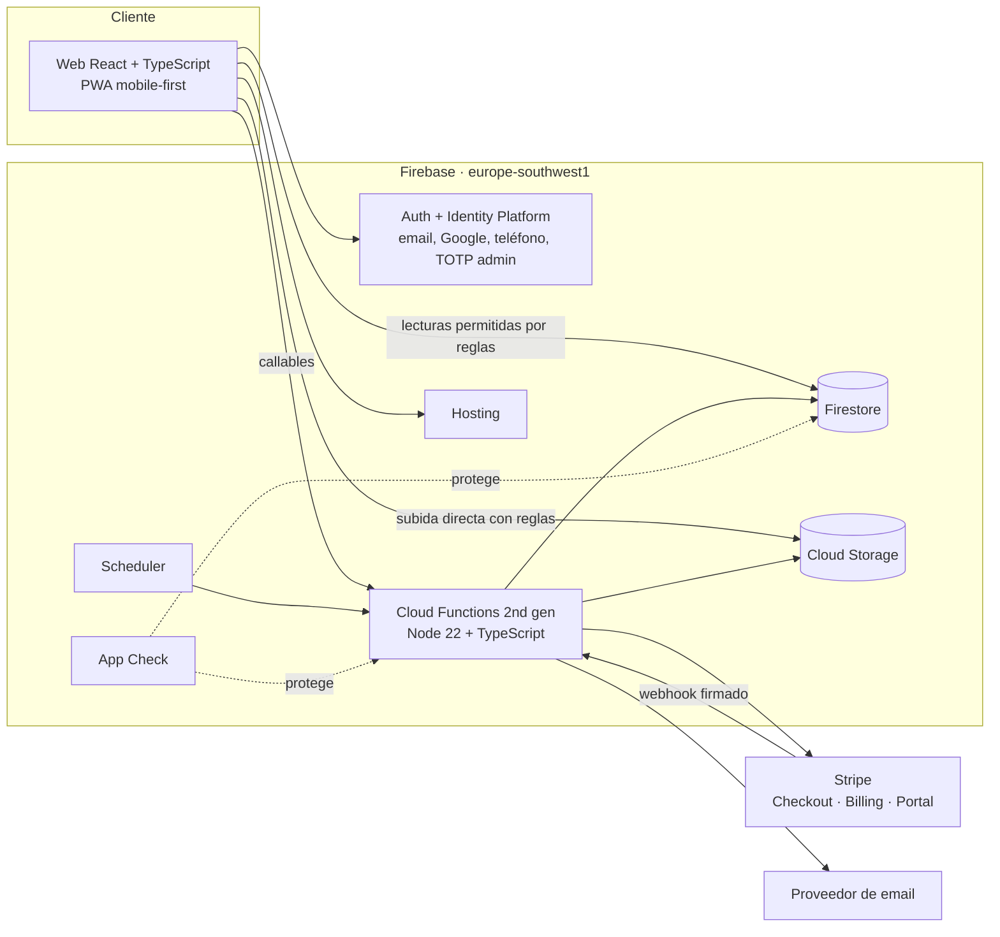

# 03 · TECHNICAL SPECIFICATION — TinHome Fase 1

| Campo | Valor |
|---|---|
| Versión | 2.0 · 08/10/2026 |
| Depende de | `01_PRD.md`, `04_DATABASE_SCHEMA.md`, `05_API_CONTRACT.md`, `07_ADR.md` |

> **Para agentes de IA:** este documento define **CÓMO** se construye. Las decisiones de fondo y su porqué están en `07_ADR.md`. Las convenciones de código, en `06_CODING_STANDARDS.md`.

---

## 1. Visión general



- **Lecturas** de datos visibles: desde el cliente con reglas de seguridad estrictas (rápido, en tiempo real donde aporta: matches, avisos).
- **Escrituras de negocio:** **solo** mediante Cloud Functions *callable* (validación con zod, reglas de negocio, transacciones, auditoría). Excepciones explícitas: subida de fotos y documentos a Storage (validadas por reglas y procesadas por trigger).
- **Dominio puro** en `packages/shared`: tipos, esquemas zod, reglas (elegibilidad, compatibilidad, ranking, fechas, validación de textos). Lo usan el frontend (para guiar) y el backend (para decidir).

---

## 2. Stack

| Capa | Tecnología | Notas |
|---|---|---|
| Lenguaje | **TypeScript** estricto (`strict`, `noUncheckedIndexedAccess`, `exactOptionalPropertyTypes`) | DEC-74 / ADR-002 |
| Gestor de paquetes | **pnpm** workspaces | Monorepo |
| Frontend | **React 19** + **Vite** | SPA + PWA (`vite-plugin-pwa`) |
| Rutas | **React Router** (modo librería, `createBrowserRouter`) | Rutas por feature con carga diferida |
| Datos servidor | **TanStack Query v5** para callables; hooks propios `useFirestoreQuery` (onSnapshot) para tiempo real | |
| Formularios | **react-hook-form** + **zod** (`@hookform/resolvers`) | Esquemas compartidos desde `@tinhome/shared` |
| UI | **Tailwind CSS v4** + **shadcn/ui** (Radix) + `lucide-react` + `sonner` | Tokens de `assets/brand/tokens.css`; temas claro/oscuro/negro con `data-theme` (`11_BRAND_GUIDELINES.md`) |
| Animación y gestos | **motion** (antes framer-motion) | `SwipeDeck` |
| Arrastrar y ordenar | **@dnd-kit** | Fotos |
| Fechas | **date-fns** + **@date-fns/tz** | `Europe/Madrid` |
| i18n | **i18next** + **react-i18next** | Solo `es` |
| PDF (kit de acuerdo) | **pdf-lib** en cliente | Plantilla versionada |
| Backend | **Cloud Functions for Firebase (2nd gen)**, Node 22 | `firebase-functions` v6+, `firebase-admin` |
| Imágenes | **sharp** en función de Storage | Quitar EXIF, redimensionar, WebP |
| Pagos | **Stripe** (`stripe` SDK Node) | Checkout, Billing, Customer Portal, Refunds |
| Email | Adaptador `EmailProvider` (consola en dev; proveedor HTTP en prod `[PENDIENTE DEC-69]`) | |
| Push | **Firebase Cloud Messaging** (web push, clave VAPID) + `firebase-messaging-sw.js` | FR-70 |
| Monitorización cliente | **Sentry** (`@sentry/react`, región UE, `sendDefaultPii: false`, scrubbing en `beforeSend`) | NFR-13; requiere DPA |
| Huella de imágenes | dHash 64 bits calculado con **sharp** | FR-64 |
| Pruebas | **Vitest**, **Testing Library**, **Playwright**, **@firebase/rules-unit-testing**, emuladores | Ver `09_TESTING_AND_QA.md` |
| Calidad | ESLint (flat config + typescript-eslint), Prettier, Husky + lint-staged | |
| CI/CD | GitHub Actions | Lint, typecheck, test, build, despliegue a staging/prod |

Versiones: usar la última **estable** de cada paquete al crear el proyecto y fijarlas en el lockfile. No usar versiones beta.

---

## 3. Estructura del monorepo

```
tinhome/
├─ CLAUDE.md · AGENTS.md · CONTRIBUTING.md · README.md
├─ docs/                         # este pack
├─ package.json                  # scripts raíz (dev, test, lint, typecheck, emulators, seed)
├─ pnpm-workspace.yaml
├─ firebase.json · .firebaserc · firestore.rules · firestore.indexes.json · storage.rules
├─ apps/
│  └─ web/
│     ├─ index.html (con head-snippet de marca) · vite.config.ts · public/ (favicons, site.webmanifest, icons/, og-image)
│     └─ src/
│        ├─ app/                 # router, providers, AppShell, guards
│        ├─ features/            # una carpeta por módulo del PRD
│        │  ├─ auth/ onboarding/ home/ travel-prefs/ verification/
│        │  ├─ discover/ explore/ likes/ matches/ exchanges/ reviews/
│        │  ├─ premium/ referrals/ notifications/ safety/ sponsored/ chat/ help/ support/
│        │  ├─ legal/ settings/ landing/ waitlist/
│        │  └─ admin/            # verification, moderation, users, cities, windows, partners, params, legal, metrics, audit, gdpr
│        ├─ components/ui/       # shadcn/ui generados
│        ├─ components/          # componentes compartidos (C-xx de UX)
│        ├─ lib/                 # firebase.ts, callables.ts, query-client.ts, analytics.ts, dates.ts
│        ├─ i18n/es.json
│        ├─ assets/brand/        # logos PNG (desde assets/brand/logo)
│        └─ styles/              # tokens.css (desde assets/brand) + globals.css
├─ functions/
│  └─ src/
│     ├─ index.ts                # solo exporta funciones
│     ├─ modules/                # un fichero/carpeta por módulo (callables + triggers)
│     ├─ core/                   # auth guards, errores, auditoría, params, rate limit, email, stripe, storage
│     └─ jobs/                   # tareas programadas
├─ packages/
│  └─ shared/
│     └─ src/
│        ├─ types/               # tipos de documentos Firestore (DTOs)
│        ├─ schemas/             # zod: entradas/salidas de callables
│        ├─ domain/              # eligibility, compatibility, ranking, exchange, premium, text-validation, dates
│        ├─ constants/           # enums, códigos de error, defaults de parámetros
│        └─ index.ts
├─ tests/
│  ├─ rules/                     # pruebas de firestore.rules y storage.rules
│  └─ e2e/                       # Playwright
└─ scripts/
   ├─ seed.ts                    # datos de ejemplo en emuladores
   └─ set-role.ts                # asignar admin/superadmin (claims)
```

---

## 4. Frontend

### 4.1 Capas
1. **Páginas** (`features/*/pages`) — componen la pantalla, sin lógica de datos compleja.
2. **Componentes** (`features/*/components`) — presentación; reciben props tipadas.
3. **Hooks de datos** (`features/*/api`) — `useXxxQuery` / `useXxxMutation` que envuelven callables (`lib/callables.ts`) o lecturas Firestore.
4. **Dominio** — importado de `@tinhome/shared` (nunca duplicar reglas en el frontend).

### 4.2 Acceso a callables
`lib/callables.ts` expone una función tipada por callable, usando los esquemas de `@tinhome/shared/schemas`:

```ts
export const callable = <I, O>(name: CallableName, input: z.ZodType<I>, output: z.ZodType<O>) =>
  async (data: I): Promise<O> => {
    const fn = httpsCallable(functions, name);
    const res = await fn(input.parse(data));
    return output.parse(res.data);
  };
```

Errores: se mapean a `AppError` con `code` del catálogo (`05_API_CONTRACT.md` §3) y se muestran con el texto de `es.json` (`errors.<code>`).

### 4.3 Estado
- Servidor: TanStack Query (`staleTime` 30 s por defecto; Descubrir sin caché persistente).
- Sesión: `AuthProvider` (usuario de Firebase + documento `users/{uid}` en tiempo real + claims).
- Local de UI: estado de React; nada de librerías globales salvo necesidad justificada.

### 4.4 Rendimiento
- Carga diferida por ruta; `admin` en un chunk separado.
- Imágenes: tamaños `thumb/card/full` en WebP desde Storage con `srcset`; precarga de las 3 tarjetas siguientes del mazo (`new Image().decode()`).
- Service worker: precache del shell; caché *stale-while-revalidate* de imágenes de casas (máx. 200 entradas).

### 4.5 Analítica (primera parte, sin cookies)
`lib/analytics.ts` → callable `trackEvent` con lista cerrada de eventos (`signup_completed`, `phone_verified`, `home_published`, `identity_submitted`, `like_sent`, `match_created`, `exchange_confirmed`, `review_submitted`, `paywall_viewed`, `checkout_started`, `premium_activated`, `invite_shared`, `sponsored_clicked`). Sin datos personales en propiedades.

---

## 5. Backend (Cloud Functions)

### 5.1 Tipos de función
| Tipo | Uso | Región |
|---|---|---|
| `onCall` | Todas las acciones de usuario y admin (`05_API_CONTRACT.md`) con `enforceAppCheck: true` | `europe-southwest1` |
| `onRequest` | Webhook de Stripe; redirección de patrocinados (`/r/:partnerId`) | `europe-southwest1` |
| `onDocumentWritten/Created` | Contadores, notificaciones, proyecciones | `europe-southwest1` |
| `onObjectFinalized` (Storage) | Procesado de fotos | `europe-southwest1` |
| `onSchedule` | Tareas programadas (§5.5) | `europe-southwest1` |

### 5.2 Esqueleto de un callable
Cada callable sigue el mismo orden (ver `06_CODING_STANDARDS.md` §6):
1. `requireAuth` → 2. guardas (`requireEmailVerified`, `requireRole`, `requireMfaForAdmin`, `requireActive`…) → 3. `schema.parse(request.data)` → 4. lectura de parámetros (`getParams()` con caché 60 s) → 5. reglas de dominio de `@tinhome/shared` → 6. transacción Firestore → 7. efectos (auditoría, eventos, notificaciones en cola) → 8. respuesta validada con el esquema de salida.

### 5.3 Guardas
`requireAuth`, `requireEmailVerified`, `requirePhoneVerified`, `requireIdentityApproved`, `requireActive`, `requireRole('admin'|'superadmin')`, `requireMfa` (claim `firebase.sign_in_second_factor` presente para admin), `requireLegalUpToDate`, `requireCityOpen`, `requireMatchParticipant(matchId)`, `requireExchangeParticipant(exchangeId)`.

### 5.4 Triggers
| Trigger | Efecto |
|---|---|
| `users/{uid}` creado (Auth `beforeUserCreated` / `onCreate`) | Crea documento `users/{uid}`, `referralCode`, valida edad declarada |
| `homes/{id}` escrito | Recalcula `homes.visible` (BR-04) y contadores de ciudad |
| `users/{uid}.verification.identity` → `APPROVED` | Recalcula visibilidad; fundador (BR-19); referido (BR-20) |
| `reviews/*` publicado | Recalcula `homes.rating` y `isTop` (BR-13) |
| Storage `homes/{uid}/raw/{photoId}` | sharp: quitar EXIF, rotar según orientación, generar `thumb` 400, `card` 1080, `full` 1600 en WebP, calcular `dhash`, borrar original, actualizar `homes.photos[]`; comprobar duplicados (§19) y cambios masivos (FR-65) |
| `mailQueue/{id}` creado | Envía con `EmailProvider`, reintentos exponenciales (máx. 5), marca estado |

### 5.5 Tareas programadas
| ID | Cuándo (Europe/Madrid) | Qué hace |
|---|---|---|
| J-01 | Cada hora | Caduca intercambios `PROPOSED` > P-19 días |
| J-02 | 01:00 diario | Intercambios `CONFIRMED` con `endDate < hoy` → `COMPLETED`; abre valoraciones |
| J-03 | 02:00 diario | Publica valoraciones con plazo vencido (doble ciego) |
| J-04 | 03:00 diario | Borra documentos de verificación con decisión > P-13 días (salvo fraude) |
| J-05 | 03:30 diario | Purga cuentas `DELETION_PENDING` > P-16 días (anonimiza valoraciones, borra fotos) |
| J-06 | 09:00 diario | Resumen de me gusta recibidos (N-06), recordatorios de intercambio (N-09) y de valoración (N-10) |
| J-07 | Cada hora | Reactiva cuentas con suspensión vencida |
| J-08 | 04:00 diario | Recalcula contadores de demanda por pareja de ciudades × ventana (FR-18) |
| J-09 | 05:00 diario | Reconcilia derechos Premium con Stripe (seguridad ante webhooks perdidos) |
| J-10 | 03:15 diario | Borra coordenadas de `locationChecks` con `purgeAt` vencido |
| J-11 | 04:30 diario | Caduca advertencias (`strikes.expiresAt`) y recalcula `strikesActive` |
| J-12 | Cada 15 min | Denuncias, retenciones y quejas próximas a vencer o vencidas → `adminAlerts` + email a admins; escala al superadmin si se supera el plazo |
| J-13 | Cada 30 min | Email resumen de mensajes no leídos (N-20) si siguen sin leer a las 2 h y no se entregó push |
| J-14 | 02:30 diario | Purga mensajes de chats cerrados con más de P-39 meses |

---

## 6. Autenticación y roles

- **Política de contraseñas** de Identity Platform: mínimo 10 caracteres, letras y números; `signOutEverywhere` usa `revokeRefreshTokens`; emails N-27 en cambios de credenciales.
- Proveedores: email/contraseña (con verificación), Google, y **teléfono vinculado** (`linkWithPhoneNumber` + reCAPTCHA invisible) para FR-07. Política de regiones de SMS: solo España.
- **Identity Platform** activado (necesario para MFA). Admins con **TOTP** obligatorio (enrolamiento guiado en el primer acceso a `/admin`).
- Roles como **custom claims** `role: 'admin' | 'superadmin'`, asignados solo por `adminSetRole` (superadmin) o `scripts/set-role.ts` (bootstrap).
- Reautenticación para baja de cuenta y cambio de email.

---

## 7. Seguridad

- **Firestore/Storage rules** con denegación por defecto y pruebas exhaustivas (`tests/rules`). Ver `04_DATABASE_SCHEMA.md` §4.
- **App Check** (reCAPTCHA Enterprise) en callables, Firestore y Storage; modo *debug token* en local.
- **Secretos** en Secret Manager (`defineSecret`): `STRIPE_SECRET_KEY`, `STRIPE_WEBHOOK_SECRET`, `EMAIL_API_KEY`, `DOC_HASH_PEPPER`.
- **Hash de documento:** `HMAC-SHA256(pepper, normalize(docNumber))`; el número en claro nunca se guarda.
- **Visor seguro:** `adminGetVerificationFileUrl` devuelve URL firmada de 5 min y registra auditoría; el cliente muestra en `<canvas>` con marca de agua.
- **Cabeceras** en Hosting: CSP estricta (scripts propios + Stripe + Google auth/reCAPTCHA), HSTS, `X-Content-Type-Options`, `Referrer-Policy: strict-origin-when-cross-origin`, `Permissions-Policy` (cámara solo en el propio origen).
- **Límites:** me gusta (BR-06), denuncias (10/día por usuario; 3/hora por IP en la pública), reenvío de email (60 s), SMS (cuota de Firebase).
- **Logs** sin PII sensible (nada de teléfonos, documentos ni emails completos).

---

## 8. Algoritmo de Descubrir (`getDiscoverDeck`)

1. **Elegibilidad del visor:** sesión válida. Si no cumple BR-05, se devuelven tarjetas igualmente (para que pueda mirar) con `canLike: false` y `blockers: [...]`.
2. **Candidatas:** consulta a `homes` con `visible == true` y `cityId in destinos` (si «cualquier ciudad abierta», todas las abiertas excepto la propia), máx. 300 por consulta, excluyendo: casa propia, bloqueos (en ambos sentidos), casas con me gusta enviado, pasos activos (< P-03 días), IDs ya servidos en la sesión (`excludeIds` del cliente, máx. 200).
3. **Puntuación** (`@tinhome/shared/domain/ranking.ts`), cada factor normalizado a [0,1]:
   - `encajeDestino`: 1 si la ciudad del visor está en los destinos del candidato (o este acepta cualquiera).
   - `solapeFechas`: ventanas comunes o días solapados de rangos flexibles / 7, tope 1.
   - `leGusto`: 1 si el titular del candidato ya dio me gusta a la casa del visor.
   - `premium`: 1 si el titular es Premium.
   - `valoracion`: `(rating − 3) / 2` acotado a [0,1]; 0,5 si no tiene valoraciones.
   - `novedad`: 1 si publicada hace < 14 días, decae linealmente hasta 0 a los 90.
   - `calidadFotos`: `min(fotos, 12) / 12`.
   - `score = Σ Wi·factor_i + ruido`, con `ruido ∈ [0, 5)` de una semilla determinista `hash(uidVisor + fecha)` para variar sin parpadeos.
4. **Ordenar** desc. y devolver 20 con `compatibility` (chips) calculada en servidor. `likedYou` solo se devuelve explícito si el visor es Premium.
5. **Intersticial patrocinado:** si el visor es gratis, insertar como mucho 1 `sponsored` por lote en la posición P-15 (contando por sesión en el cliente).

Escala: suficiente para miles de casas por ciudad. Si se supera, materializar `deckCandidates/{uid}` en un job nocturno (Fase 2).

---

## 9. Validación de textos (BR-22)

`@tinhome/shared/domain/text-validation.ts` → `validateListingText(text): { ok: true } | { ok: false, reasons: TextViolation[] }`:

| Violación | Patrón (orientativo, insensible a mayúsculas y acentos) |
|---|---|
| `PHONE` | 9 o más dígitos con separadores opcionales, prefijos `+34`, `0034` |
| `EMAIL` | `[\w.+-]+@[\w-]+\.[\w.]+` y variantes ofuscadas («arroba», «(at)») |
| `URL` | `https?://`, `www.`, dominios `\.(com|es|net|org|io)\b` |
| `PRICE` | importes con `€`, `eur`, `euros`, «precio», «tarifa» |
| `RENTAL` | «alquil\*», «se alquila», «por noche», «/noche», «€/noche», «reserva», «pago», «bizum», «transferencia» |

Se aplica en servidor (`upsertHome`, `updateProfile`) y en cliente (aviso en línea).

---

## 10. Pagos (Stripe)

- **Productos/precios** creados en Stripe: `premium_monthly`, `premium_yearly`, con **impuestos incluidos** en el precio (`tax_behavior: inclusive`). IDs en `STRIPE_PRICE_MONTHLY` / `STRIPE_PRICE_YEARLY`.
- `createCheckoutSession({ plan })` → busca o crea `stripeCustomerId` → `checkout.sessions.create({ mode: 'subscription', customer, line_items, success_url, cancel_url, consent_collection?: { terms_of_service: 'required' }, metadata: { uid } , subscription_data: { metadata: { uid } } })`. Requiere que el cliente envíe `acceptImmediateStart: true` (registro en `legalAcceptances` tipo `WITHDRAWAL_START`).
- `createPortalSession()` → portal configurado para cancelar **al final del periodo**, cambiar plan y método de pago, ver facturas.
- **Webhook** `stripeWebhook` (`onRequest`, firma verificada, idempotente con `stripeEvents/{eventId}`):

| Evento | Acción |
|---|---|
| `checkout.session.completed` | Vincula `subscriptionId` al usuario |
| `customer.subscription.created/updated` | Actualiza `subscriptions/{uid}` (estado, plan, `currentPeriodEnd`, `cancelAtPeriodEnd`) y el derecho `STRIPE` → recalcula `premiumUntil` |
| `customer.subscription.deleted` | Cierra el derecho `STRIPE` |
| `invoice.payment_failed` | N-12 (pago fallido) |
| `invoice.paid` | N-12 (renovado) |
| `charge.refunded` | Registro |

- **Desistimiento** `withdrawSubscription()`: solo si `now − firstSubscribedAt ≤ P-07D` y nunca desistió antes; cancela inmediatamente y reembolsa la última factura (`FULL`) o la parte proporcional no consumida (`PRORATED`), registra auditoría y envía N-12.
- **Derechos Premium** (`entitlements/{id}`): `{ uid, source: STRIPE|FOUNDER|REFERRAL|ADMIN, startsAt, endsAt }`. `users.premiumUntil` = máximo `endsAt` vigente (calculado en servidor, BR-17).

---

## 11. Email

- Interfaz `EmailProvider.send({ to, templateId, data })`. Implementaciones: `ConsoleEmailProvider` (dev/emuladores, imprime en log) y `HttpEmailProvider` configurable por variables de entorno (`EMAIL_PROVIDER`, `EMAIL_API_KEY`, `EMAIL_FROM`) `[PENDIENTE DEC-69: proveedor con servidores en la UE]`.
- Los emails se encolan en `mailQueue` (desacopla, permite reintentos y auditoría).
- Plantillas en `functions/src/core/email/templates/*.ts` (funciones que devuelven `{ subject, html, text }`), en español, accesibles.

---

## 12. Entornos y configuración

| Entorno | Proyecto Firebase | Stripe | Datos |
|---|---|---|---|
| `local` | Emuladores (`demo-tinhome`) | Modo test con Stripe CLI (`stripe listen`) | `pnpm seed` |
| `staging` | `tinhome-staging` | Modo test | Ficticios |
| `prod` | `tinhome-prod` | Modo live | Reales |

Variables del frontend (`apps/web/.env.*`, prefijo `VITE_`): `VITE_FIREBASE_*`, `VITE_APPCHECK_SITE_KEY`, `VITE_USE_EMULATORS`, `VITE_PUBLIC_URL`. Nunca secretos en el frontend.

Región única: **`europe-southwest1` (Madrid)** para Firestore, Storage y Functions. Es irreversible para Firestore: fijarla en la creación del proyecto.

---

## 13. Datos de ejemplo (`scripts/seed.ts`)

Para desarrollar con una UX realista en emuladores:
- Ciudades: Madrid (`OPEN`), Valencia (`OPEN`), Málaga (`WAITLIST`), Barcelona (`WAITLIST`).
- Ventanas: «Semana Santa 2027» (2027-03-20 → 2027-03-28), «Puente de mayo 2027» (2027-04-30 → 2027-05-03), «Primera quincena de agosto 2027», «Segunda quincena de agosto 2027».
- 60 usuarios con casas (mitad Madrid, mitad Valencia), identidad aprobada en 50, 10 Premium, 5 Top con valoraciones, me gusta cruzados para generar 8 matches, 3 intercambios en distintos estados.
- Fotos: generadas localmente (SVG/PNG con degradados y el nombre de la estancia) para no depender de servicios externos.
- Usuarios fijos: `laura@demo.tinhome` (gratis, Madrid), `javier@demo.tinhome` (Premium, Valencia), `admin@demo.tinhome` (superadmin; en emulador el MFA se simula) — contraseña `Demo1234!`.

---

## 14. CI/CD

- PR: `pnpm install --frozen-lockfile` → `lint` → `typecheck` → `test` (unit + rules + functions con emuladores) → `build`.
- `main` → despliegue automático a **staging** + E2E Playwright contra staging.
- Etiqueta `v*` → despliegue a **prod** con aprobación manual.
- `firebase deploy --only hosting,functions,firestore:rules,firestore:indexes,storage`.

---

## 15. Observabilidad

- Logs estructurados (`logger` de `firebase-functions`) con `requestId`, `uid` (seudónimo), `callable`, `durationMs`, `errorCode`.
- Alertas (Cloud Monitoring): errores del webhook de Stripe, tasa de error de callables > 2 % en 10 min, fallos de `mailQueue`, fallos de jobs, latencia p95 de `sendMessage` > 1,5 s.
- Errores del navegador: Sentry (UE), muestreo 100 % errores / 10 % trazas, sin PII, *release* por despliegue con *source maps* subidos (no publicados).
- Costes: alertas de presupuesto en Cloud Billing al 50/80/100 %; cuota diaria de SMS; `minInstances` solo en `sendMessage`.

## 16. Chat

- **Modelo:** `matches/{id}/messages`. Lectura en tiempo real con `onSnapshot` (`orderBy createdAt desc, limit 50`, paginación hacia arriba con `startAfter`). Persistencia local de Firestore (`persistentLocalCache` con varias pestañas) para funcionar con mala conexión.
- **Escritura** por la callable `sendMessage` (`minInstances: 1`, 256 MiB): valida participante, estado del match, retenciones y bloqueos, longitud (P-28) y ritmo (P-29, contador por minuto en `likeCounters`-like `chatCounters/{uid}_{minute}` con TTL); detecta menciones de pago (`/bizum|transferencia|iban|paypal|pagar|señal|fianza/i`) → `paymentWarning`; en una transacción escribe el mensaje, `lastMessage`, `unread[otro]++`; después encola push (N-20).
- **Cliente:** mensaje optimista con estado «enviando» y `clientRequestId`; si falla, «No enviado · Reintentar». Idempotencia por `clientRequestId` (consulta previa en la transacción).
- **Leído:** `markConversationRead` al abrir el chat y al recibir mensajes con la pestaña visible (Page Visibility API).
- **Mensajes de sistema** los escribe el servidor (match creado, teléfono compartido, intercambio propuesto/confirmado/cancelado).
- **Moderación:** el equipo **no** lee los chats de forma general; solo accede a los mensajes incluidos en una denuncia (instantánea en `reports.targetSnapshot`) con auditoría.

## 17. Notificaciones push

- FCM web con VAPID; `firebase-messaging-sw.js` en la raíz del Hosting (integrado con el service worker de la PWA mediante `importScripts`).
- Registro de token tras aceptar `PushPrompt` → `registerPushToken`; renovación en cada inicio de sesión; tokens inválidos se borran al enviar.
- Contenido mínimo y sin datos sensibles: «Javier te ha escrito» (sin el texto del mensaje en la notificación por defecto; opción en Ajustes para mostrar vista previa).
- Clic en la notificación → abre `/app/chats/:matchId` (o la ruta del evento).
- iOS/iPadOS 16.4+: solo con la PWA instalada; detectar y mostrar la guía de instalación.

## 18. Verificación de ubicación

1. Cliente: `navigator.geolocation.getCurrentPosition({ enableHighAccuracy: true, timeout: 20000, maximumAge: 0 })`; detectar móvil (`matchMedia('(pointer: coarse)')` + `userAgentData.mobile` si existe). En escritorio, mostrar QR con la URL de `/app/verificacion/ubicacion`.
2. Servidor `verifyHomeLocation`: rechaza precisión > 200 m (`INACCURATE`); calcula distancia *haversine* al `cities.center`; `PASS` si ≤ `radiusKm`; máx. 5 intentos/día; guarda en `locationChecks` coordenadas redondeadas a 2 decimales (≈ 1 km) con `purgeAt` = ahora + P-13 días; actualiza `homes.locationCheck` y recalcula `visible`.
3. `FAIL` reiterado → el usuario puede pedir revisión manual (`requestLocationReview`) → alerta `LOCATION_MANUAL` → `adminDecideLocationReview`.
4. Limitación conocida: la ubicación del navegador se puede falsear con herramientas; por eso es una señal más (junto con documento de la casa, fotos duplicadas y denuncias), no una prueba definitiva.

## 19. Detección de fotos duplicadas

- `dhash` de 64 bits (redimensionar a 9×8 en escala de grises con sharp, comparar píxeles adyacentes) por foto.
- Índice `photoHashIndex` en 8 bandas de 8 bits: cualquier par con distancia de Hamming ≤ 7 comparte al menos una banda (principio del palomar), así que buscar candidatos en las 8 bandas encuentra todos los duplicados con umbral P-36 ≤ 7.
- Para cada candidato de **otra casa** con Hamming ≤ P-36 → `homes.moderationHold = { reason: 'PHOTO_DUPLICATE' }`, alerta `PHOTO_DUPLICATE` con ambas fotos para comparar, N-23 al titular.
- Limitación: no detecta fotos copiadas de portales externos; para eso están las denuncias «Fotos que no son de su vivienda» y la verificación de ubicación.

## 20. Advertencias, retenciones y alertas de administración

- `adminModerate` con `recordStrike: true` crea `strikes/{id}`, incrementa `strikesActive` y devuelve `suggestedNext` según BR-41 (el admin lo aplica con otra acción explícita: nunca sanción automática).
- Retención preventiva (BR-42) la activa `submitReport` (denuncia grave de usuario con identidad aprobada o umbral P-34 de denunciantes distintos en 30 días) o los triggers de fotos; fija `moderationHold.dueAt`; envía la declaración provisional (N-23) y crea `adminAlerts`.
- Alertas: el panel escucha `adminAlerts` sin atender en tiempo real (badge + sonido opcional); email a todos los admins para prioridad alta; J-12 vigila plazos.

## 21. Copias de seguridad y continuidad

- Firestore: **PITR** activado (7 días) + **copias programadas diarias** con retención de 30 días en la misma región.
- Storage: versionado de objetos (30 días) en el bucket de fotos.
- Procedimiento de restauración documentado en `docs/runbooks/restore.md` (crear en M10) y probado en staging antes del lanzamiento.
- Exportación de configuración (`config`, `cities`, `windows`, `legalDocs`, `faqs`) en el repositorio vía `scripts/export-config.ts`.
- Panel de métricas de negocio en `/admin/metricas` (FR-54).
