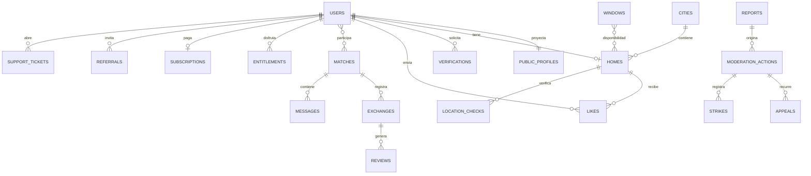

# 04 · DATABASE SCHEMA — Firestore + Storage

| Campo | Valor |
|---|---|
| Versión | 2.0 · 08/10/2026 |
| Motor | Cloud Firestore (modo nativo), región `europe-southwest1` |
| Fuente de tipos | `packages/shared/src/types/*.ts` (un tipo por colección; este documento es la referencia) |

> **Convenciones:** IDs en `camelCase` para campos; colecciones en `camelCase` plural. Fechas-hora como `Timestamp`; **fechas de calendario como `string` `YYYY-MM-DD`** (BR-32). Importes en **céntimos enteros** (`…Cents`). Enums en `UPPER_SNAKE_CASE`. Todo documento de negocio tiene `createdAt` y `updatedAt` (servidor). **R** = obligatorio, **O** = opcional, **S** = lo escribe solo el servidor.

---

## 1. Mapa de colecciones

| Colección | ID | Lectura cliente | Escritura cliente |
|---|---|---|---|
| `users` | `uid` | Propietario; admin | ✗ (callables) |
| `publicProfiles` | `uid` | Usuarios con email verificado | ✗ |
| `homes` | `uid` (1 casa por usuario) | `visible == true` (usuarios verificados por email) · propietario · admin | ✗ |
| `likes` | `{fromUid}_{toUid}` | Solo el emisor (`fromUid == auth.uid`) | ✗ |
| `passes` | `{uid}_{homeId}` | ✗ | ✗ |
| `matches` | `{uidMenor}_{uidMayor}` | Participantes | ✗ |
| `exchanges` | auto | Participantes | ✗ |
| `reviews` | `{exchangeId}_{authorUid}` | `status == PUBLISHED` (verificados) · autor · admin | ✗ |
| `blocks` | `{blockerUid}_{blockedUid}` | Solo quien bloquea | ✗ |
| `verifications` | `verificationId` (generado por el cliente; carpeta de Storage) | Admin (el propietario lee su estado con `getMyVerification`, M4) | ✗ |
| `docHashes` | `hash` | ✗ | ✗ |
| `cities` | slug (`madrid`) | Pública | ✗ |
| `windows` | auto | Pública | ✗ |
| `demandStats` | `{fromCity}_{toCity}_{windowId}` | Pública | ✗ |
| `waitlist` | `sha256(email)` | ✗ | ✗ |
| `demandCounters` | `{from}_{to}_{window}` | ✗ | ✗ |
| `rateLimits` | `{scope}_{hash}_{ventana}` | ✗ | ✗ |
| `referralCodes` | código (8 caracteres) | ✗ | ✗ |
| `entitlements` | auto | Propietario · admin | ✗ |
| `subscriptions` | `uid` | Propietario · admin | ✗ |
| `referrals` | `inviteeUid` | Invitador · admin | ✗ |
| `notifications/{uid}/items` | auto | Propietario | Solo campo `readAt` |
| `legalDocs` (+ `versions`) | slug / versión | Pública | ✗ |
| `legalAcceptances` | auto | Propietario · admin | ✗ |
| `config` | `public`, `params` | `public`: todos · `params`: admin | ✗ |
| `partners` | auto | Admin | ✗ |
| `partnerClicks` | auto | Admin | ✗ |
| `reports` | auto | Admin | ✗ |
| `moderationActions` | auto | Admin · afectado (las suyas) | ✗ |
| `appeals` | auto | Admin · recurrente | ✗ |
| `gdprRequests` | auto | Propietario · admin | ✗ |
| `likeCounters` | `{uid}_{YYYY-MM-DD}` | ✗ | ✗ |
| `chatCounters` | `{uid}_{YYYYMMDDHHmm}` | ✗ | ✗ |
| `events` | auto | ✗ (agregados vía admin) | ✗ |
| `auditLog` | auto | Superadmin | ✗ |
| `mailQueue` | auto | ✗ | ✗ |
| `stripeEvents` | `eventId` | ✗ | ✗ |
| `matches/{id}/messages` | auto | Participantes del match | ✗ (callable `sendMessage`) |
| `locationChecks` | auto | Propietario (resultado) · admin | ✗ |
| `photoHashIndex` | `{band}_{value}` | ✗ | ✗ |
| `strikes` | auto | Afectado · admin | ✗ |
| `supportTickets` (+ `messages`) | auto | Propietario · admin | ✗ |
| `faqs` | slug | Pública (`published == true`) · admin | ✗ |
| `users/{uid}/pushTokens` | `sha256(token)` | ✗ | ✗ |
| `adminAlerts` | auto | Admin | ✗ |

---

## 2. Documentos

### 2.1 `users/{uid}` (privado)
| Campo | Tipo | R/O | Notas |
|---|---|---|---|
| `email` | string | R,S | Copia de Auth |
| `firstName`, `lastName` | string | R | Nombre legal; solo propietario y admin |
| `birthDate` | string `YYYY-MM-DD` | R | BR-01 |
| `phoneE164` | string | O,S | Tras FR-07 |
| `status` | `ACTIVE`\|`SUSPENDED`\|`BANNED`\|`DELETION_PENDING`\|`DELETED` | R,S | |
| `suspendedUntil` | Timestamp | O,S | |
| `verification` | `{ emailVerified: bool, phoneVerified: bool, identity: IdentityStatus, identityDecidedAt?: Timestamp, latestId?: string, docHash?: string }` | R,S | `latestId`: última verificación (M4); `docHash`: hash con *pepper* del documento aprobado, para BR-20 |
| `onboarding` | `{ step: 1..6, completedAt?: Timestamp }` | R,S | |
| `cityId` | string | O,S | Ciudad de su casa (copia) |
| `premiumUntil` | Timestamp \| null | R,S | BR-17 |
| `strikesActive` | int | R,S | Advertencias vigentes (BR-41) |
| `moderationHold` | `{ active: bool, reason, since, reportId? } \| null` | O,S | Retención preventiva de la cuenta (BR-42) |
| `premiumMessages` | `{ date: 'YYYY-MM-DD', count: int }` | O,S | Contador de me gusta con mensaje (P-27) |
| `premiumSource` | `STRIPE`\|`FOUNDER`\|`REFERRAL`\|`ADMIN` \| null | O,S | Origen del derecho más largo |
| `foundingMember` | bool | R,S | BR-19 |
| `referralCode` | string (8, sin ambiguos) | R,S | Único |
| `referredBy` | uid | O,S | Inmutable |
| `stripeCustomerId` | string | O,S | |
| `firstSubscribedAt` | Timestamp | O,S | Desistimiento |
| `withdrawalUsed` | bool | R,S | |
| `legal` | `{ [docSlug]: version }` | R,S | Versiones aceptadas |
| `settings` | `{ theme: 'system'\|'light'\|'dark'\|'black', notifications: { [category]: bool } }` | R | Vía `updateSettings` |
| `deletionRequestedAt` | Timestamp | O,S | |
| `waitlistPrefill` | `{ cityId, destinations, windowIds }` | O,S | M2 · copia de la lista de espera con el mismo email (FR-19) para precargar los pasos 3–4 |

### 2.2 `publicProfiles/{uid}` (proyección pública, la mantiene el servidor)
`displayName` (nombre + inicial), `photoUrl?`, `about?` (≤ 300), `languages: string[]`, `travelsWith?: 'SOLO'|'COUPLE'|'FAMILY'|'FRIENDS'`, `memberSince: Timestamp`, `identityVerified: bool`, `foundingMember: bool`, `isTopHost: bool`, `ratingAvg?: number`, `reviewsCount: number`, `homeId?: string`, `active: bool`.

### 2.3 `homes/{uid}`
| Campo | Tipo | R/O | Notas |
|---|---|---|---|
| `ownerUid` | string | R,S | = ID |
| `status` | `DRAFT`\|`PUBLISHED`\|`PAUSED`\|`HIDDEN_BY_ADMIN` | R,S | |
| `statusBeforeHidden` | string | O,S | Para restaurar |
| `visible` | bool | R,S | **Calculado** por BR-04 en trigger |
| `title` | string 10–70 | R | BR-22 |
| `description` | string 50–1500 | R | BR-22 |
| `cityId` | string | R | FK `cities` |
| `zone` | string ≤ 60 | R | Barrio/zona; nunca dirección |
| `type` | `FLAT`\|`HOUSE`\|`STUDIO`\|`PENTHOUSE`\|`DUPLEX`\|`VILLA`\|`OTHER` | R | |
| `tenure` | `OWNER`\|`TENANT` | R | `TENANT` exige autorización (FR-08) |
| `residenceUse` | `PRIMARY`\|`SECONDARY` | R | |
| `sizeM2` | int 10–1000 | R | |
| `bedrooms` / `beds` / `bathrooms` | int | R | Rangos FR-10 |
| `maxGuests` | int 1–12 | R | |
| `petsAllowed` | bool | R | |
| `amenities` | `Amenity[]` | R | Lista cerrada en `constants` |
| `houseRules` | string ≤ 500 | O | BR-22 |
| `photos` | `{ id, order, thumbUrl, cardUrl, fullUrl, width, height, dhash: string (16 hex) }[]` | R,S | 5–20 para publicar; `dhash` para FR-64 |
| `destinations` | `{ mode: 'LIST'\|'ANY_OPEN', cityIds: string[] }` | R | ≤ P-23 |
| `availability` | `{ windowIds: string[], ranges: { start: string, end: string }[] }` | R | ≤ P-24 rangos |
| `travelers` | `{ count: int 1–12, withPet: bool }` | R | |
| `declaration` | `{ version: string, acceptedAt: Timestamp }` | O,S | FR-12 |
| `rating` | `{ avg: number, count: int, sub: { cleanliness, accuracy, communication, care } }` | R,S | |
| `isTop` | bool | R,S | BR-13 |
| `locationCheck` | `{ status: 'NONE'\|'PASS'\|'FAIL'\|'MANUAL_PENDING'\|'MANUAL_APPROVED'\|'MANUAL_REJECTED', checkedAt?, distanceKm?, note?, requestedAt?, reason?, decidedBy?, decidedAt? }` | R,S | BR-39; `PASS` o `MANUAL_APPROVED` cuentan como verificada y no se deshacen con una lectura posterior |
| `moderationHold` | `{ active: bool, reason: 'PHOTO_DUPLICATE'\|'PHOTO_CHANGES'\|'CITY_CHANGE'\|'REPORT', since, reportId?, dueAt } \| null` | O,S | BR-42 |
| `photoChangeLog` | `{ at: Timestamp, replaced: int }[]` | O,S | FR-65 (últimos 30 días) |
| `ownerPremium` | bool | R,S | Copia para ranking |
| `ownerFounding` | bool | R,S | Copia para badge |
| `publishedAt` | Timestamp | O,S | |
| `searchKeys` | `{ capacityBucket: int, hasPets: bool }` | R,S | Para filtros |

### 2.4 `likes/{fromUid}_{toUid}`
`fromUid`, `toUid`, `toHomeId`, `fromHomeId`, `message?` (≤ P-40, solo Premium, FR-61), `createdAt`. (Borrado al deshacer match o bloquear.)

### 2.5 `passes/{uid}_{homeId}`
`uid`, `homeId`, `expiresAt` (= ahora + P-03 días). TTL de Firestore sobre `expiresAt`.

### 2.6 `matches/{uidA}_{uidB}` (`uidA < uidB`)
| Campo | Tipo | Notas |
|---|---|---|
| `participants` | `[uidA, uidB]` | Para reglas y consultas `array-contains` |
| `homeIds` | `{ [uid]: homeId }` | |
| `status` | `ACTIVE`\|`UNMATCHED`\|`BLOCKED` | |
| `compatibility` | `{ perfectFit: bool, mutualDestination: bool, sharedWindowIds: string[], overlapDays: int }` | Calculado al crear |
| `unseenBy` | `string[]` | uids que aún no lo han abierto |
| `lastMessage` | `{ text (≤ 120), senderUid, at, type } \| null` | Vista previa en la lista de chats |
| `unread` | `{ [uid]: int }` | No leídos por participante |
| `lastReadAt` | `{ [uid]: Timestamp }` | Para «✓✓ leído» |
| `phoneSharedBy` | `string[]` | uids que han compartido su teléfono en este match (BR-08) |
| `activeExchangeId` | string \| null | |
| `createdAt`, `lastActivityAt`, `closedAt?`, `closedBy?` | | |

### 2.7 `exchanges/{id}`
`matchId`, `participants: [uidA, uidB]`, `proposedBy`, `startDate`, `endDate` (strings), `nights` (S), `guests: { [uid]: int }` (personas que cada uno lleva a la casa del otro), `pets: { [uid]: int }`, `note?` (≤ 300), `status: PROPOSED|CONFIRMED|DECLINED|EXPIRED|CANCELLED|COMPLETED`, `expiresAt`, `confirmedAt?`, `cancelledBy?`, `cancelReason?`, `completedAt?`, `reviewDeadline?` (Timestamp).

### 2.7b `matches/{matchId}/messages/{messageId}`
`senderUid` (null en mensajes de sistema), `type: 'TEXT'|'SYSTEM'|'PHONE_SHARED'|'PREMIUM_LIKE_MESSAGE'`, `text` (≤ P-28), `systemCode?` (`MATCH_CREATED`, `EXCHANGE_PROPOSED`…), `paymentWarning: bool` (S, el texto menciona pagos), `hiddenByModeration: bool`, `deletedFor: string[]` («eliminar para mí»), `clientRequestId`, `createdAt` (servidor). Inmutable salvo `hiddenByModeration`/`deletedFor`.

### 2.8 `reviews/{exchangeId}_{authorUid}`
`exchangeId`, `authorUid`, `targetUid`, `targetHomeId`, `overall: 1–5`, `sub: { cleanliness, accuracy, communication, care }` (1–5), `comment?` (≤ 1000), `status: PENDING|PUBLISHED`, `commentHidden: bool`, `publishedAt?`, `createdAt`.

### 2.9 `blocks/{blockerUid}_{blockedUid}`
`blockerUid`, `blockedUid`, `createdAt`.

### 2.10 `verifications/{id}`
`uid`, `status: PENDING|INFO_REQUESTED|APPROVED|REJECTED`, `tenure`, `propertyDocType: DEED|LAND_REGISTRY_NOTE|IBI_RECEIPT|RENTAL_CONTRACT|UTILITY_BILL`, `files: { idFront, idBack, selfie, propertyDoc, landlordAuthorization? }` (rutas de Storage), `docNumberHash` (S), `duplicateOfUid?` (S), `reviewerUid?`, `decisionReason?`, `infoRequest?`, `fraudSuspicion: bool`, `submittedAt`, `decidedAt?`, `filesPurgeAt?` (`null` con sospecha de fraude: no se borra), `filesPurgedAt?`. Ficheros en `private/verifications/{uid}/{id}/{clave}`.

### 2.11 `docHashes/{hash}`
`uid`, `createdAt`. Garantiza un documento por cuenta (BR-02).

### 2.12 `cities/{slug}`
`name`, `province`, `region`, `timezone` (`Europe/Madrid` | `Atlantic/Canary`), `center: { lat, lng }`, `radiusKm` (defecto P-30), `status: WAITLIST|OPEN|CLOSED`, `openThreshold` (int, defecto P-12), `counters: { visibleCandidates: int, waitlist: int, foundersAwarded: int }` (S), `order: int`.

### 2.13 `windows/{id}`
`name`, `startDate`, `endDate`, `active: bool`, `cityIds: string[] | null` (null = todas), `order`.

### 2.14 `demandStats/{fromCityId}_{toCityId}_{windowId}`
`fromCityId`, `toCityId`, `windowId`, `count` (S; se publica solo si ≥ P-18), `updatedAt`.

### 2.15 `waitlist/{sha256(email)}`
`email` (normalizado: sin espacios y en minúsculas), `cityId`, `destinations: string[]`, `windowIds: string[]`, `status: PENDING_CONFIRMATION|CONFIRMED|CONVERTED|UNSUBSCRIBED`, `confirmToken` (SHA-256 del token; el token en claro solo viaja en el email), `confirmTokenExpiresAt` (S, 7 días), `privacyVersion` + `privacyAcceptedAt` (consentimiento del visitante; no hay `uid` para `legalAcceptances`), `lastEmailAt` (S, reenvío ≥ 60 s), `createdAt`, `updatedAt`, `confirmedAt?`.

### 2.15b `demandCounters/{fromCityId}_{toCityId}_{windowId}` (solo servidor, M1)
`fromCityId`, `toCityId`, `windowId`, `count`, `updatedAt`. Recuento bruto (también < P-18). `demandStats` es su proyección pública y solo existe cuando `count ≥ P-18` (FR-18), porque las reglas no pueden ocultar campos.

### 2.15c `rateLimits/{scope}_{hash}_{ventana}` (solo servidor, M1)
`scope`, `count`, `expiresAt` (TTL). Contador de ventana fija para callables públicas (`joinWaitlist`: 10/h por IP). La clave guarda solo un hash de la IP, nunca la IP.

### 2.16 `entitlements/{id}`
`uid`, `source: STRIPE|FOUNDER|REFERRAL|ADMIN`, `startsAt`, `endsAt`, `refId?` (subscriptionId / referralId / auditId), `reason?` (ADMIN), `revokedAt?`.

### 2.17 `subscriptions/{uid}`
`stripeCustomerId`, `stripeSubscriptionId`, `plan: MONTHLY|YEARLY`, `status` (estado Stripe), `currentPeriodEnd`, `cancelAtPeriodEnd`, `startedAt`, `updatedAt`.

### 2.17b `referralCodes/{code}` (solo servidor, M2)
`uid`, `createdAt`. Garantiza que cada código de invitación es único (se reserva con `create` en la transacción de `completeSignup`) y permite resolver `?ref=` sin consultas.

### 2.18 `referrals/{inviteeUid}`
`inviterUid`, `inviteeUid`, `code`, `status: REGISTERED|REWARDED|INELIGIBLE`, `ineligibleReason?`, `rewardedAt?`.

### 2.19 `notifications/{uid}/items/{id}`
`type` (N-xx), `title`, `body`, `link` (ruta interna), `createdAt`, `readAt?`.

### 2.20 `legalDocs/{slug}` y `legalDocs/{slug}/versions/{version}`
Slugs: `aviso-legal`, `terminos`, `privacidad`, `cookies`, `normas-comunidad`, `info-dsa`, `declaracion-responsable`, `autorizacion-arrendador`, `acuerdo-intercambio`. Documento padre: `currentVersion`, `title`. Versión: `markdown`, `publishedAt`, `requiresReacceptance: bool`, `changeSummary`.

### 2.21 `legalAcceptances/{id}`
`uid`, `type: TERMS|PRIVACY|DECLARATION|WITHDRAWAL_START|COMMUNITY_RULES`, `version`, `acceptedAt`, `ipTruncated` (/24), `context?` (`homeId`).

### 2.22 `config/public` y `config/params`
- `public`: lo que necesita el cliente: `freeDailyLikes`, `premiumMonthlyPriceCents`, `premiumYearlyPriceCents`, `photosMin`, `photosMax`, `maxDestinations`, `maxFlexibleRanges`, `exchangeMaxNights`, `withdrawalDays`, `sponsoredEveryNCards`.
- `params`: todos los P-xx de `01_PRD.md` §9 (fuente de verdad del servidor). `updateParams` mantiene `public` sincronizado.

### 2.23 `partners/{id}` y `partnerClicks/{id}`
Partner: `name`, `category: CLEANING|KEYS|TRANSPORT|LUGGAGE|TRAVEL_INSURANCE|OTHER`, `title`, `text` (≤ 140), `logoUrl`, `targetUrl`, `cityIds | null`, `placements: ('MATCH'|'EXCHANGE'|'DECK')[]`, `active`, `startsAt?`, `endsAt?`. Click: `partnerId`, `placement`, `uidHash?`, `createdAt`.

### 2.24 Moderación
- `reports/{id}`: `reporterUid?` (null si pública), `reporterName?`, `reporterEmail?`, `targetType: HOME|USER|REVIEW|MESSAGE`, `targetId` (para `MESSAGE`: `matchId/messageId`), `targetUid`, `targetSnapshot` (S, copia del contenido; para mensajes, el denunciado y los 10 anteriores), `reason: PHOTOS_NOT_OWN|RUDE|HARASSMENT|INAPPROPRIATE_MESSAGES|FRAUD|HIDDEN_RENTAL|ILLEGAL|PERSONAL_DATA|OTHER`, `reporterVerified: bool` (S), `dueAt` (S, 24/72 h), `description`, `attachments: string[]`, `status`, `priority: HIGH|NORMAL`, `assignedTo?`, `createdAt`, `resolvedAt?`.
- `moderationActions/{id}`: `targetUid`, `targetType`, `targetId`, `action: WARN|HIDE_CONTENT|SUSPEND|BAN|RESTORE`, `suspendedUntil?`, `statementOfReasons: { facts, ground: 'LAW'|'TERMS', groundDetail, scope, duration, redress }`, `reportId?`, `adminUid`, `createdAt`, `notifiedAt`.
- `appeals/{id}`: `actionId`, `uid`, `text`, `status: OPEN|UPHELD|REJECTED`, `reviewerUid?`, `decisionText?`, `createdAt`, `decidedAt?`.

### 2.24b Seguridad, ayuda y atención
- `locationChecks/{id}`: `uid`, `homeId`, `cityId`, `latRounded`, `lngRounded` (2 decimales), `accuracyM`, `distanceKm` (entero), `result: PASS|FAIL|INACCURATE`, `userAgentMobile: bool`, `createdAt`, `purgeAt` (coordenadas borradas a P-13 días por J-10, que deja `coordinatesPurgedAt`; el resto se conserva). Intentos diarios (5) en `rateLimits/location_{hash(uid)}_{fecha}`.
- `photoHashIndex/{band}_{value}`: `entries: { homeId, photoId, dhash }[]` — índice por bandas de 8 bits del `dhash` de 64 bits (8 bandas) para buscar candidatos a duplicado (FR-64).
- `strikes/{id}`: `uid`, `actionId`, `reason`, `severity: 'MINOR'|'SERIOUS'`, `createdAt`, `expiresAt` (P-31), `revokedAt?` (si prospera un recurso).
- `supportTickets/{id}`: `number` (`TH-AAAA-NNNNNN`, contador atómico), `uid?` (null si visitante), `email`, `category: ACCOUNT|VERIFICATION|PREMIUM_BILLING|MODERATION_DECISION|TECHNICAL|OTHER`, `subject`, `description`, `attachments`, `status: RECEIVED|IN_REVIEW|WAITING_USER|RESOLVED|CLOSED`, `assignedTo?`, `dueAt` (P-38), `createdAt`, `resolvedAt?`. Subcolección `messages`: `authorType: USER|ADMIN`, `authorUid?`, `text`, `createdAt`.
- `faqs/{slug}`: `category`, `question`, `answerMarkdown`, `order`, `published`, `tags[]`, `helpfulYes`, `helpfulNo` (S), `updatedAt`.
- `users/{uid}/pushTokens/{sha256(token)}`: `token`, `platform: 'web'`, `userAgent`, `createdAt`, `lastSeenAt`. Se borran si FCM responde «no registrado».
- `adminAlerts/{id}`: `type: REPORT_HIGH|PHOTO_DUPLICATE|HOLD_DUE|COMPLAINT_DUE|LOCATION_MANUAL|VERIFICATION_DUPLICATE` (M4), `refType`, `refId`, `priority`, `createdAt`, `handledBy?`, `handledAt?`.

### 2.25 Otros
- `gdprRequests/{id}`: `uid`, `type: ACCESS|RECTIFICATION|ERASURE|OBJECTION|RESTRICTION|PORTABILITY`, `details`, `status: OPEN|DONE|REJECTED`, `dueAt`, `exportPath?`, `createdAt`, `closedAt?`.
- `likeCounters/{uid}_{date}`: `count`, `hourBuckets: { [HH]: int }`. TTL a 3 días.
- `chatCounters/{uid}_{YYYYMMDDHHmm}`: `count`. Límite de mensajes por minuto (BR-36). TTL a 1 día.
- `events/{id}`: `name`, `uidHash`, `cityId?`, `props` (sin PII), `createdAt`. TTL 400 días.
- `auditLog/{id}`: `actorUid`, `actorRole`, `action`, `targetType`, `targetId`, `before?`, `after?`, `reason?`, `createdAt`. Solo inserción.
- `mailQueue/{id}`: `to`, `templateId`, `data`, `status: QUEUED|SENT|FAILED`, `attempts`, `lastError?`, `createdAt`, `sentAt?`, `expiresAt` (TTL 90 días).
- `stripeEvents/{eventId}`: `type`, `processedAt`. TTL 90 días.

---

## 3. Índices compuestos (`firestore.indexes.json`)

| Colección | Campos | Uso |
|---|---|---|
| `homes` | `visible ASC, cityId ASC, publishedAt DESC` | Descubrir / Explorar por ciudad |
| `homes` | `visible ASC, cityId ASC, isTop ASC, rating.avg DESC` | Casas Top |
| `homes` | `visible ASC, cityId ASC, searchKeys.capacityBucket ASC` | Filtro capacidad |
| `likes` | `toUid ASC, createdAt DESC` | Me gusta recibidos |
| `messages` (grupo) | `createdAt DESC` por match | Hilo del chat (paginado) |
| `matches` | `participants ARRAY_CONTAINS, status ASC, lastMessage.at DESC` | Lista de chats |
| `reports` | `status ASC, dueAt ASC` | Plazos de moderación (J-12) |
| `homes` | `moderationHold.active ASC, moderationHold.dueAt ASC` | Retenciones |
| `supportTickets` | `status ASC, dueAt ASC` / `uid ASC, createdAt DESC` | Cola de quejas / Mis solicitudes |
| `strikes` | `uid ASC, expiresAt DESC` | Advertencias activas |
| `adminAlerts` | `handledAt ASC, createdAt DESC` | Alertas en tiempo real |
| `faqs` | `published ASC, category ASC, order ASC` | Centro de ayuda |
| `matches` | `participants ARRAY_CONTAINS, status ASC, lastActivityAt DESC` | Lista de matches |
| `exchanges` | `participants ARRAY_CONTAINS, status ASC, startDate ASC` | Intercambios del usuario |
| `exchanges` | `status ASC, endDate ASC` | J-02 |
| `exchanges` | `status ASC, expiresAt ASC` | J-01 |
| `reviews` | `targetHomeId ASC, status ASC, publishedAt DESC` | Valoraciones de una casa |
| `reviews` | `status ASC, createdAt ASC` | J-03 |
| `verifications` | `status ASC, submittedAt ASC` | Cola de admin |
| `verifications` | `filesPurgeAt ASC` | J-04 |
| `reports` | `status ASC, priority ASC, createdAt ASC` | Cola de moderación |
| `notifications/items` | `createdAt DESC` (por usuario) | Centro de avisos |
| `entitlements` | `uid ASC, endsAt DESC` | Cálculo de `premiumUntil` |
| `auditLog` | `targetType ASC, targetId ASC, createdAt DESC` | Auditoría |

Políticas TTL: `passes.expiresAt`, `likeCounters` (campo `expiresAt`), `chatCounters.expiresAt`, `rateLimits.expiresAt`, `mailQueue.expiresAt`, `events`, `stripeEvents`. Borrados programados por job: coordenadas de `locationChecks` (J-10), mensajes de chats cerrados (P-39, J-05).

---

## 4. Reglas de seguridad

### 4.1 `firestore.rules` (base que debe implementarse y probarse)

```
rules_version = '2';
service cloud.firestore {
  match /databases/{db}/documents {
    function signedIn() { return request.auth != null; }
    function uid() { return request.auth.uid; }
    function emailVerified() { return signedIn() && request.auth.token.email_verified == true; }
    function role() { return signedIn() ? request.auth.token.get('role', '') : ''; }
    function isAdmin() { return role() in ['admin', 'superadmin']
                         && request.auth.token.get('firebase', {}).get('sign_in_second_factor', null) != null; }
    function isSuperadmin() { return isAdmin() && role() == 'superadmin'; }

    // Por defecto: nada
    match /{document=**} { allow read, write: if false; }

    match /users/{userId} { allow read: if signedIn() && (uid() == userId || isAdmin()); }
    match /publicProfiles/{userId} { allow read: if emailVerified(); }
    match /homes/{homeId} {
      allow read: if emailVerified() && (resource.data.visible == true || uid() == homeId || isAdmin());
    }
    match /likes/{likeId} { allow read: if signedIn() && resource.data.fromUid == uid(); }
    match /matches/{matchId} {
      allow read: if signedIn() && (uid() in resource.data.participants || isAdmin());
      // Mensajes: solo lectura para participantes; se escriben con la callable sendMessage
      match /messages/{messageId} {
        allow read: if signedIn() && (uid() in get(/databases/$(db)/documents/matches/$(matchId)).data.participants || isAdmin());
      }
    }
    match /locationChecks/{id} { allow read: if signedIn() && (resource.data.uid == uid() || isAdmin()); }
    match /strikes/{id} { allow read: if signedIn() && (resource.data.uid == uid() || isAdmin()); }
    match /supportTickets/{id} {
      allow read: if signedIn() && (resource.data.uid == uid() || isAdmin());
      match /messages/{m} { allow read: if signedIn() && (get(/databases/$(db)/documents/supportTickets/$(id)).data.uid == uid() || isAdmin()); }
    }
    match /faqs/{slug} { allow read: if resource.data.published == true || isAdmin(); }
    match /adminAlerts/{id} { allow read: if isAdmin(); }
    match /exchanges/{id} { allow read: if signedIn() && (uid() in resource.data.participants || isAdmin()); }
    match /reviews/{id} {
      allow read: if emailVerified() && (resource.data.status == 'PUBLISHED' || resource.data.authorUid == uid() || isAdmin());
    }
    match /blocks/{id} { allow read: if signedIn() && resource.data.blockerUid == uid(); }
    // M4: el propietario usa getMyVerification (el documento incluye el hash y posibles uids duplicados)
    match /verifications/{id} { allow read: if isAdmin(); }
    match /cities/{id} { allow read: if true; }
    match /windows/{id} { allow read: if true; }
    match /demandStats/{id} { allow read: if true; }
    match /legalDocs/{slug} { allow read: if true;
      match /versions/{v} { allow read: if true; } }
    match /config/public { allow read: if true; }
    match /config/params { allow read: if isAdmin(); }
    match /entitlements/{id} { allow read: if signedIn() && (resource.data.uid == uid() || isAdmin()); }
    match /subscriptions/{userId} { allow read: if signedIn() && (uid() == userId || isAdmin()); }
    match /referrals/{id} { allow read: if signedIn() && (resource.data.inviterUid == uid() || isAdmin()); }
    match /legalAcceptances/{id} { allow read: if signedIn() && (resource.data.uid == uid() || isAdmin()); }
    match /gdprRequests/{id} { allow read: if signedIn() && (resource.data.uid == uid() || isAdmin()); }
    match /moderationActions/{id} { allow read: if signedIn() && (resource.data.targetUid == uid() || isAdmin()); }
    match /appeals/{id} { allow read: if signedIn() && (resource.data.uid == uid() || isAdmin()); }
    match /notifications/{userId}/items/{id} {
      allow read: if signedIn() && uid() == userId;
      allow update: if signedIn() && uid() == userId
        && request.resource.data.diff(resource.data).affectedKeys().hasOnly(['readAt'])
        && request.resource.data.readAt is timestamp;
    }
    match /reports/{id} { allow read: if isAdmin(); }
    match /partners/{id} { allow read: if isAdmin(); }
    match /partnerClicks/{id} { allow read: if isAdmin(); }
    match /auditLog/{id} { allow read: if isSuperadmin(); }
    // passes, docHashes, waitlist, likeCounters, events, mailQueue, stripeEvents: sin acceso de cliente
  }
}
```

> **Bloqueos y visibilidad:** las reglas no pueden comprobar bloqueos de forma eficiente. Por eso Descubrir, Explorar y la ficha de casa se sirven **por callables** que aplican BR-04/BR-10. La lectura directa de `homes` está permitida para documentos visibles (necesaria para enlaces y caché), y los datos de una casa visible no son sensibles (sin dirección). Las valoraciones y el perfil de un usuario bloqueado se filtran en las callables.

### 4.2 `storage.rules`

```
rules_version = '2';
service firebase.storage {
  match /b/{bucket}/o {
    function signedIn() { return request.auth != null; }
    function isImage() { return request.resource.contentType.matches('image/(jpeg|png|webp|heic|heif)'); }
    function isDoc() { return isImage() || request.resource.contentType == 'application/pdf'; }
    function under10MB() { return request.resource.size < 10 * 1024 * 1024; }

    match /{all=**} { allow read, write: if false; }

    // Fotos originales de la casa: el propietario sube; nadie lee (el trigger las procesa y borra)
    match /homes/{userId}/raw/{photoId} {
      allow create: if signedIn() && request.auth.uid == userId && isImage() && under10MB();
    }
    // Fotos procesadas: lectura para usuarios con email verificado; escritura solo servidor
    match /homes/{userId}/photos/{file} {
      allow read: if signedIn() && request.auth.token.email_verified == true;
    }
    match /avatars/{userId}/{file} {
      allow read: if signedIn() && request.auth.token.email_verified == true;
      allow create, update: if signedIn() && request.auth.uid == userId && isImage() && request.resource.size < 5 * 1024 * 1024;
    }
    // Documentos de verificación: el propietario solo crea; lectura únicamente por URL firmada del servidor
    match /private/verifications/{userId}/{verificationId}/{file} {
      allow create: if signedIn() && request.auth.uid == userId && isDoc() && under10MB();
    }
    // Adjuntos de denuncias (usuario autenticado)
    match /private/reports/{userId}/{file} {
      allow create: if signedIn() && request.auth.uid == userId && isImage() && request.resource.size < 5 * 1024 * 1024;
    }
  }
}
```

---

## 5. Relaciones (resumen)



---

## 6. Migraciones y datos

- Esquema versionado en código (`packages/shared/src/types`). Cambios incompatibles → script en `scripts/migrations/NNN-descripcion.ts` idempotente, ejecutable contra emuladores primero.
- Datos personales en `staging`: **nunca** reales.
